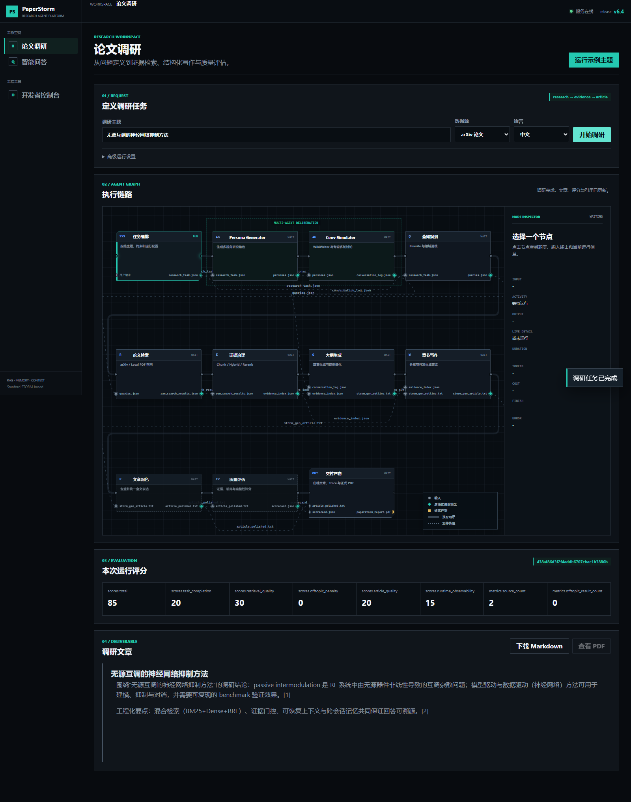
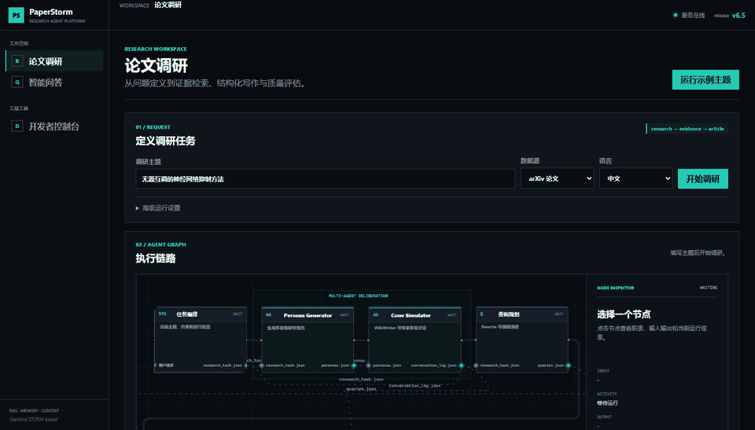
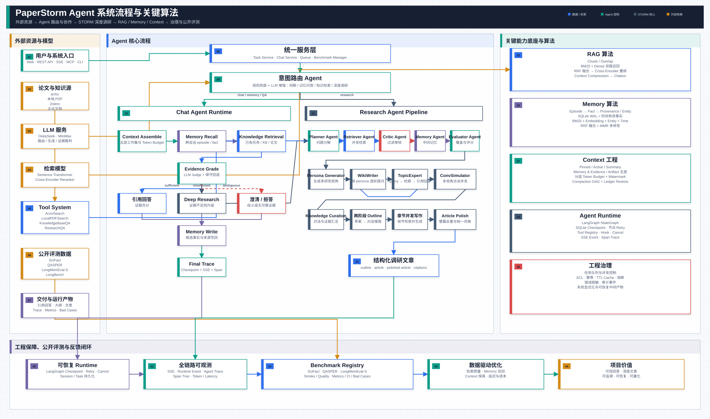
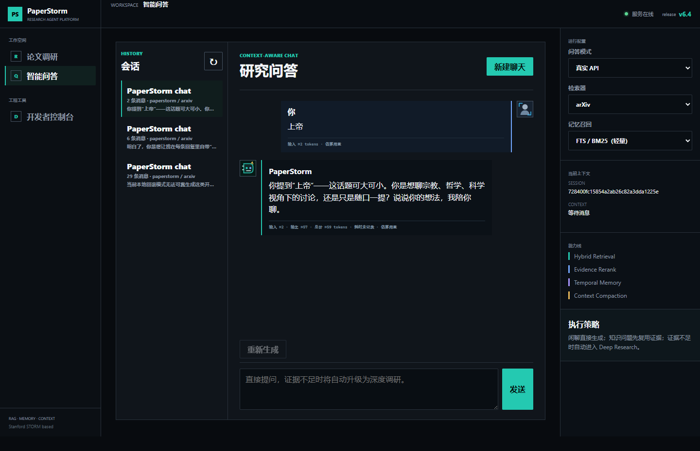
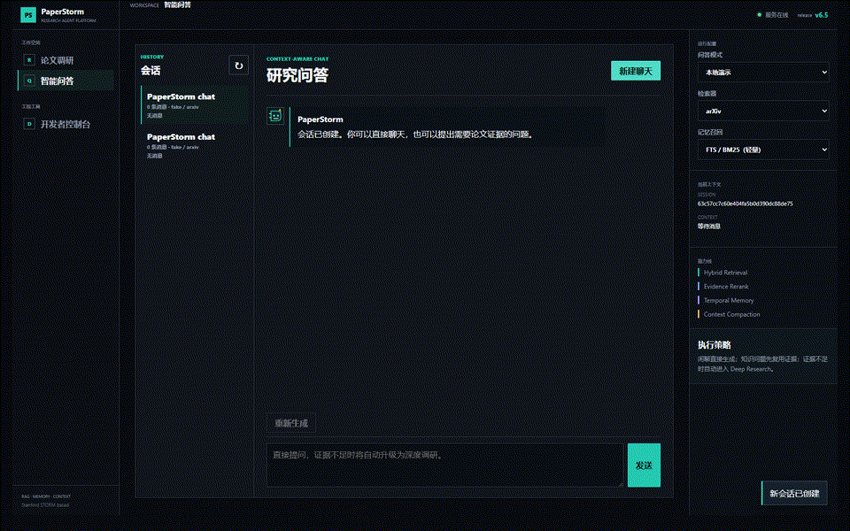
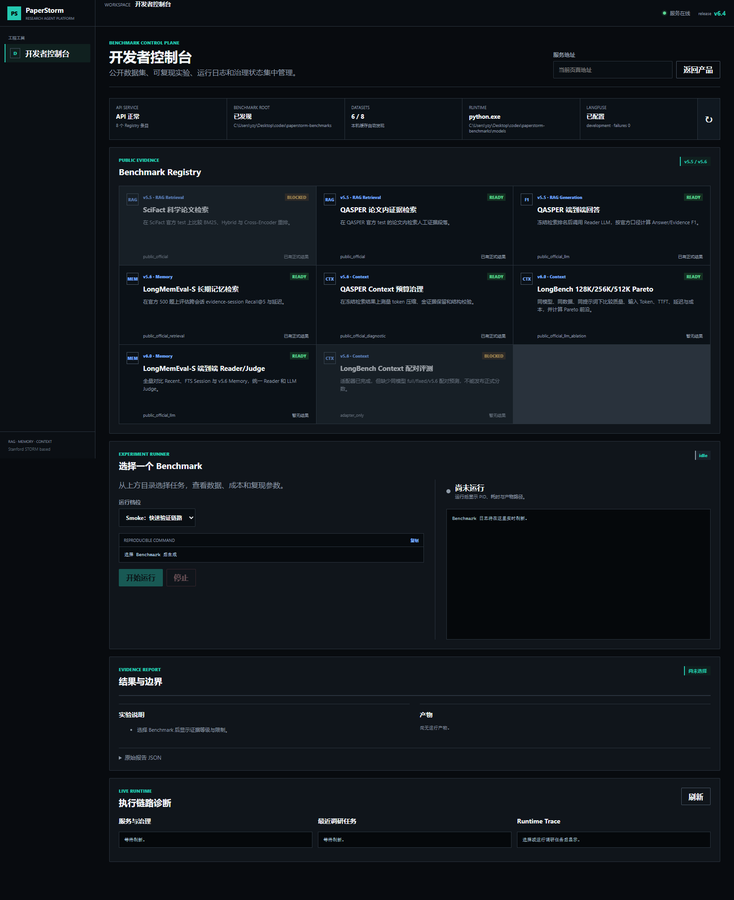

# PaperStorm Agent

PaperStorm Agent 是基于 Stanford STORM 扩展的论文调研与知识问答平台。系统面向科学论文、
本地 PDF、Zotero 文献库和企业内部文档，提供多 Agent 深度调研、证据约束问答、混合检索、
跨会话记忆、上下文治理、运行时恢复、公开 Benchmark 与 Langfuse 可观测性。





## 核心能力

| 能力域 | 当前实现 | 工程边界 |
| --- | --- | --- |
| 深度调研 | Persona Generator、Conv Simulator、Query Planner、Retriever、Outline、Section Writer、Polisher、Evaluator | 保留 Stanford STORM 的多视角调研与两阶段写作流程 |
| 知识问答 | 普通对话、会话召回、证据检索、证据充分性判断、按需升级深度调研 | 外部论文证据不写入用户长期记忆 |
| RAG | 领域 BM25、冻结 Embedding Profile、Exact/HNSW Dense、RRF、选择性 Cross-Encoder、来源过滤与引用映射 | 产品入口和公开 Benchmark 统一使用 `RetrievalPipeline`；ACL scoped 请求使用授权子集 Exact |
| Memory | SQLite WAL、事实与 episode、provenance、时间有效性、BM25/真实向量、RRF、MMR | 只保存稳定用户事实、偏好、决策和可复用流程 |
| Context | Pinned、Active、Summary、Memory、Evidence、Artifact 分层预算 | 支持结构化递归摘要、压缩 lineage 和恢复 |
| Runtime | LangGraph、SQLite checkpoint、节点重试、幂等、ACL、缓存、熔断与 trace | 对话状态、调研任务和控制面持久化 |
| Evaluation | SciFact、QASPER、LongMemEval-S、PIM 领域 Pilot、Context Pareto、Answer/Evidence F1 | smoke 仅用于确定性验证，quality profile 才可形成质量结论 |
| Observability | 本地 JSONL、SSE、Langfuse Trace/Span/Score | 敏感字段脱敏，远程观测失败不阻断业务链路 |

## 系统架构

### 业务流程


[Draw.io 可编辑源文件](docs/architecture/paperstorm-executive-overview.drawio)


[完整系统架构 HTML 源文件](docs/architecture/paperstorm-system-architecture.html)

### Agent 与数据流



[Draw.io 可编辑源文件](docs/architecture/paperstorm-agent-system-flow.drawio)

### 官方 STORM 基础架构

PaperStorm 保留 Stanford STORM 的知识策展、视角生成、专家访谈、两阶段大纲生成、并行章节写作
与文章润色流程，并在其外围增加统一 RAG、Memory、Context、Agent Runtime、服务控制面和评测系统。
官方模块中文说明见 [STORM_OFFICIAL_CN.md](docs/STORM_OFFICIAL_CN.md)。

```text
Stanford STORM Workflow
        |
        v
PaperStorm Retrieval / Memory / Context
        |
        v
Conversation Runtime / Production Control Plane
        |
        v
FastAPI + SSE + Web Dashboard + Langfuse
```

## RAG 主链

```text
Source ingestion
  -> structure-aware chunking
  -> BM25 recall + Dense recall
  -> Reciprocal Rank Fusion
  -> optional Cross-Encoder rerank
  -> relevance and forbidden-term gate
  -> evidence package with provenance
  -> Reader / article writer
  -> citation validation
```

核心模块：

- `knowledge_storm/document_ingestion.py`：PDF 解析、页码/标题保留与结构化切分。
- `knowledge_storm/retrieval.py`：BM25、Dense、RRF、Cross-Encoder 和持久化 Hybrid Index。
- `knowledge_storm/retrieval_pipeline.py`：产品与 Benchmark 共用的检索契约，固定
  `retrieve/fuse/rerank/gate` stage schema。
- `knowledge_storm/retrieval_runtime.py`：调研产物索引缓存和运行时适配。
- `knowledge_storm/paperstorm_qa.py`：带引用的调研结果问答。
- `knowledge_storm/paperstorm_enterprise_kb.py`：本地文档知识库、ACL、增量重建和缓存失效。

真实服务默认使用 SentenceTransformer。`HashEmbeddingProvider` 仅用于单元测试和 smoke profile，
不能作为公开质量结果。旧 JSON hash 索引不会被静默读取；系统会明确要求重建，避免检索行为悄然降级。

### 检索运行档

| Profile | 模型 | 维度 | 定位 |
| --- | --- | ---: | --- |
| `legacy-multilingual` | `paraphrase-multilingual-MiniLM-L12-v2` | 384 | 历史兼容与回归基线 |
| `cpu-zh` | `BAAI/bge-small-zh-v1.5` | 512 | 中文 CPU 检索 |
| `cpu-multilingual` | `Alibaba-NLP/gte-multilingual-base` | 768 | 默认多语种 CPU 档 |
| `quality-multilingual` | `Qwen/Qwen3-Embedding-0.6B` | 1024 | GPU 或离线质量优先档 |

Profile 冻结模型 revision、最大序列长度、query/document 编码角色、归一化和必要批次。
语料达到 20,000 个向量时可自动构建 USearch HNSW；小库保留 Exact oracle。带 ACL 的请求
不会先从全库 ANN 取候选再过滤，而是 fail-closed 到授权子集 Exact，避免敏感候选进入后续链路。

RAG 的已知 bad case、工业方案对照和后续路线见
[RAG_BAD_CASES_AND_ROADMAP.md](docs/RAG_BAD_CASES_AND_ROADMAP.md)。

## Memory、Context 与 Evidence 边界

- **Session Recall**：从当前用户的历史会话中检索消息和旧话题，用于“之前聊过什么”。
- **Long-term Memory**：保存用户稳定偏好、明确事实、长期决策和可复用流程，支持跨会话召回。
- **Evidence**：保存论文或内部文档中的外部事实、chunk、作者、标题、URL、页码和引用关系。
- **Context**：为当前 LLM 调用组装系统约束、近期消息、结构化摘要、召回记忆、证据与工具产物。

用户询问“之前聊过的 PIM 论文”时，Session Recall 负责找回旧会话中的论文指针，Evidence
负责重新取得论文原文，Long-term Memory 只补充用户偏好，不把论文结论伪装成用户事实。

稳定模块：

- `knowledge_storm/memory_policy.py`
- `knowledge_storm/memory_store.py`
- `knowledge_storm/context_engine.py`
- `knowledge_storm/paperstorm_session_recall.py`
- `knowledge_storm/conversation_runtime.py`
- `knowledge_storm/control_plane.py`

## Benchmark

| 检索 | 记忆 | 上下文 | 回答 |
| --- | --- | --- | --- |
|  |  |  |  |

### 公开评测矩阵

| Benchmark | 评估对象 | 主要指标 |
| --- | --- | --- |
| SciFact | 跨论文科学事实检索 | Recall@10、MRR@10、nDCG@10、P95 |
| QASPER Retrieval | 论文内人工证据定位 | Evidence Recall@5、MRR@5、nDCG@5、P95 |
| QASPER Answer | 端到端 Reader | Answer F1、Exact Match、Evidence F1 |
| LongMemEval-S | 跨会话长期记忆 | Evidence-session Recall@5、类别 Recall、P50/P95 |
| QASPER Context | 上下文预算治理 | token ratio、gold evidence retention、validation rate |
| Context Pareto | 长上下文配置 | 质量、输入 Token、TTFT、成本和 Pareto frontier |
| PIM Domain Pilot | 50 条本地论文证据绑定问题 | Recall@5、MRR@5、Answer F1、Citation Precision、ANN Recall |

### 已记录结果

以下结果来自仓库中的公开数据集报告，延迟为本机 CPU 参考值，不代表线上 SLA。

| 累积里程碑 | 受影响评测 | 主要结果 | 结论 |
| --- | --- | --- | --- |
| P1：规划与结构化召回 | SciFact / QASPER Retrieval / PIM 固定集 | SciFact Recall@10 `0.8114`；QASPER Recall@5 `0.5057` | 建立可复现基线；PIM/RAM 领域歧义固定案例通过 |
| P1+P2：选择性重排与证据治理 | SciFact / QASPER Retrieval / Evidence Governance | SciFact Recall@10 `0.8264`；QASPER Recall@5 `0.5526`；相对 P1 配对 CI 均不跨 0 | Cross-Encoder 只在风险/不确定查询触发；Top K 内 recall-safe MMR 不替换已召回成员 |
| P1+P2+P3：Claim-Citation | QASPER Answer | 1451 条 test：Answer F1 `0.5083`、Evidence F1 `0.5500`、Claim support `0.9592`、unsupported claim `0.0214`、失败 `0` | 相对 v5.5 的跨指纹方向性对比为 Answer F1 `-0.0358`；可信度可观测性增强，但传统答案覆盖仍需优化 |
| P1+P2+P3+P4：生产治理 | Production Governance 8-case | ACL/Trace 泄漏 `0`；失败率 `0`；缓存隔离、超时、熔断恢复、Release Gate 全部通过 | 完全离线、不调用 LLM；不重复运行未受影响的质量数据集 |
| LongMemEval-S Memory | LongMemEval-S | Recall@5 `0.8003`，P95 `359.3 ms` | 仅代表 evidence-session retrieval，不等同端到端回答准确率 |
| v7.0 PIM Domain Pilot | 5 篇论文、797 chunks、50 questions | GTE Recall@5 `0.7200`；Answer F1 `0.3983`；Citation Precision `0.9237`；真实向量 HNSW Recall@5 `1.0000` | 私有领域 pilot；题目由模型生成，不作为公开榜单或生产 SLA |

### Embedding 与规模诊断

以下模型对比固定为 BM25 + Dense + RRF、关闭 Reranker 并使用 Exact oracle。只采样 10%
query；SciFact 搜索完整 5,183 篇摘要，QASPER 保留抽中问题所属论文的全部 5,265 个段落和
hard negatives。该小样本用于工程选型，不替代完整 test 与置信区间。

| 数据集 | Profile | Recall@5 | nDCG@5 | Build | Query P95 |
| --- | --- | ---: | ---: | ---: | ---: |
| SciFact, 30 query | Legacy | 0.6583 | 0.5398 | 119.3 s | 84.3 ms |
| SciFact, 30 query | BGE small zh | 0.6167 | 0.5099 | 279.1 s | 179.6 ms |
| SciFact, 30 query | GTE multilingual | 0.6750 | 0.5738 | 2326.8 s | 328.1 ms |
| SciFact, 30 query | Qwen3 Embedding 0.6B | **0.7250** | **0.5973** | 8457.8 s | 1769.7 ms |
| QASPER, 131 query | Legacy | 0.4673 | 0.3626 | 133.3 s | 68.0 ms |
| QASPER, 131 query | BGE small zh | 0.3746 | 0.3012 | 154.6 s | 34.5 ms |
| QASPER, 131 query | GTE multilingual | **0.5457** | **0.4351** | 927.2 s | 201.9 ms |
| QASPER, 131 query | Qwen3 Embedding 0.6B | 0.5468 | 0.4348 | 2869.7 s | 345.0 ms |

100,000 个 384 维随机向量的本机微基准中，USearch HNSW 的 P95 为 `21.591 ms`，Exact
为 `198.504 ms`，HNSW Recall@10 为 `0.9055`。这是规模行为诊断，不是论文检索质量结论；
2,000,000 向量只报告原始 float32 容量估算，不外推延迟。完整协议、具体改善/退化案例与边界见
[PAPERSTORM_RETRIEVAL_STACK_UPGRADE.md](docs/PAPERSTORM_RETRIEVAL_STACK_UPGRADE.md)。

v7.0 的 PIM 领域协议、三模型比较、50 条 Reader 评测和真实 Bad Case 见
[PAPERSTORM_DOMAIN_PILOT.md](docs/PAPERSTORM_DOMAIN_PILOT.md)。

详细协议、样本量、split、模型和证据等级见
[PAPERSTORM_V55_PUBLIC_BENCHMARKS.md](docs/PAPERSTORM_V55_PUBLIC_BENCHMARKS.md) 与
[PAPERSTORM_V56_MEMORY_CONTEXT.md](docs/PAPERSTORM_V56_MEMORY_CONTEXT.md)。P1-P4 的
配对区间、失败候选与具体 Bad Case 见
[RAG_BADCASE_PROGRESSIVE_RESULTS.md](docs/RAG_BADCASE_PROGRESSIVE_RESULTS.md)。

## 快速开始

### 环境要求

- Python 3.10 或 3.11。
- 调研真实模式需要 DeepSeek 或 MiniMax API Key。
- quality Benchmark 需要公开数据集和本地模型缓存。

### 安装

```powershell
git clone https://github.com/yzy-151/paperstorm-agent.git
cd paperstorm-agent
D:\SOFTWARE\spyder\envs\storm\python.exe -m pip install -e .
```

### 启动服务

```powershell
D:\SOFTWARE\spyder\envs\storm\python.exe examples\storm_examples\start_paperstorm_service.py `
  --service-root .\results\paperstorm_demo_service `
  --host 127.0.0.1 `
  --port 8002
```

浏览器访问 <http://127.0.0.1:8002>。

也可以直接通过 Uvicorn 启动 ASGI 应用：

```powershell
D:\SOFTWARE\spyder\envs\storm\python.exe -m uvicorn examples.storm_examples.paperstorm_service_api:app `
  --host 127.0.0.1 `
  --port 8002
```

Web Dashboard 包含三个工作区：

1. **论文调研模式**：提交 arXiv 或本地 PDF 调研任务，查看 Agent Graph、实时节点状态、文章与 PDF。
2. **智能问答模式**：进行多轮聊天；证据不足时可升级检索或深度调研；展示时间与 Token 遥测。
3. **开发者控制台**：发现本地数据集、运行公开 Benchmark、查看命令、日志、状态与结果指标。







### 如何复现公开 Benchmark

以下命令分别用于确定性 smoke 和真实论文质量评测。真实论文质量结论必须使用冻结数据 split、
真实 embedding 和完整样本，不能由 smoke 结果替代。

```powershell
# 离线 smoke，仅验证数据适配器、指标和产物链路
D:\SOFTWARE\spyder\envs\storm\python.exe examples\storm_examples\run_paperstorm_public_benchmark.py `
  --benchmark scifact `
  --dataset-dir <scifact-dir> `
  --output-dir <output-dir> `
  --embedding hash `
  --modes bm25 hybrid `
  --smoke-limit 20

# quality profile，使用真实 embedding 与 Cross-Encoder
D:\SOFTWARE\spyder\envs\storm\python.exe examples\storm_examples\run_paperstorm_public_benchmark.py `
  --benchmark qasper `
  --dataset-dir <qasper-test-json> `
  --output-dir <output-dir> `
  --embedding real `
  --modes bm25 dense hybrid hybrid_rerank `
  --reranker `
  --top-k 5

# PIM 领域 pilot，使用 50 条证据绑定问题比较三个真实 Embedding Profile
D:\SOFTWARE\spyder\envs\storm\python.exe examples\storm_examples\run_pim_domain_pilot.py `
  --corpus "$env:PAPERSTORM_BENCHMARK_ROOT\domain-pim-v7\corpus.jsonl" `
  --cases "$env:PAPERSTORM_BENCHMARK_ROOT\domain-pim-v7\cases.jsonl" `
  --output-dir "$env:PAPERSTORM_BENCHMARK_ROOT\domain-pim-v7\runs" `
  --model-cache "$env:PAPERSTORM_BENCHMARK_ROOT\models" `
  --top-k 5
```

## Langfuse 可观测性

Langfuse 为可选依赖：

```powershell
D:\SOFTWARE\spyder\envs\storm\python.exe -m pip install -e ".[observability]"
$env:PAPERSTORM_OBSERVABILITY="langfuse"
$env:LANGFUSE_PUBLIC_KEY="pk-lf-..."
$env:LANGFUSE_SECRET_KEY="sk-lf-..."
$env:LANGFUSE_BASE_URL="https://cloud.langfuse.com"
```

映射关系：

| PaperStorm 操作 | Langfuse 对象 | Score |
| --- | --- | --- |
| 调研任务 | `paperstorm.research` trace + pipeline spans | run success、scorecard metrics |
| 对话轮次 | `paperstorm.chat` trace + graph node spans | trajectory success、retrieval triggered |
| Benchmark | `paperstorm.benchmark` trace | metrics.json 数值指标、run success |

未启用 Langfuse 时，事件仍写入 `<service-root>/observability/events.jsonl`。测试环境设置
`PAPERSTORM_OFFLINE_TESTS=1` 后会禁用远程 exporter 和模型下载。

## 关键环境变量

| 变量 | 说明 |
| --- | --- |
| `PAPERSTORM_RETRIEVAL_EMBEDDING` | `auto` / `real` / `hash`；生产默认 real，hash 仅供测试 |
| `PAPERSTORM_RETRIEVAL_MODE` | `hybrid` / `bm25` / `dense` / `hybrid_rerank` |
| `PAPERSTORM_EMBEDDING_PROFILE` | `legacy-multilingual` / `cpu-zh` / `cpu-multilingual` / `quality-multilingual` |
| `PAPERSTORM_RERANKER_PROFILE` | `cpu-balanced` / `quality-gpu` |
| `PAPERSTORM_RETRIEVAL_INDEX_CACHE_SIZE` | 运行时索引 LRU 容量 |
| `PAPERSTORM_MODEL_CACHE` | SentenceTransformer/Cross-Encoder 模型缓存目录 |
| `PAPERSTORM_BENCHMARK_ROOT` | SciFact、QASPER、LongMemEval 等数据集根目录 |
| `PAPERSTORM_ZOTERO_ROOT` | Zotero 数据目录 |
| `PAPERSTORM_OBSERVABILITY` | 设置为 `langfuse` 启用远程观测 |
| `PAPERSTORM_OFFLINE_TESTS` | 设置为 `1` 禁止测试访问远程观测与模型下载 |

## 项目结构

```text
knowledge_storm/
  document_ingestion.py            # PDF 与结构化 chunk
  retrieval.py                     # 领域 BM25 / Dense / RRF / Cross-Encoder
  retrieval_profiles.py            # Embedding 与 Reranker 冻结合同
  dense_index.py                   # Exact / USearch HNSW 后端
  text_analyzers.py                # Jieba 领域词典与 CJK fallback
  retrieval_pipeline.py            # 产品与 Benchmark 的统一检索契约
  retrieval_runtime.py             # 调研产物索引与缓存
  context_engine.py                # 分层上下文预算、压缩与恢复
  memory_policy.py                 # 长期记忆候选与写入策略
  memory_store.py                  # SQLite temporal memory
  conversation_runtime.py          # LangGraph 会话运行时
  control_plane.py                 # ACL、幂等、缓存、任务与 trace
  paperstorm_service.py            # 应用服务层
  evaluation/public_benchmarks/    # SciFact/QASPER/LongMemEval adapters
  evaluation/domain_pilot.py       # 私有领域题集合同与证据校验
examples/storm_examples/           # FastAPI、MCP 与 Benchmark CLI
frontend/paperstorm_dashboard/     # 调研、问答和开发者控制台
tests/                              # 离线单元、API、前端与评测契约测试
docs/                               # 架构、评测协议、路线图与开发记录
```

## 质量边界与路线图

当前系统已经完成查询规划、结构化召回、Embedding Profile、Exact/HNSW、领域分词、
选择性 Rerank、Parent Context 公平预算、证据冲突治理、Claim-Citation 校验、检索前 ACL、
运行韧性与离线发布门禁。剩余重点是优化 QASPER 抽象回答覆盖、GPU 质量档、真实论文向量的
HNSW Pareto，并把离线 Release Gate 接入 CI 与预发布 canary。相关案例和验收指标见
[RAG_BAD_CASES_AND_ROADMAP.md](docs/RAG_BAD_CASES_AND_ROADMAP.md)。

## License

MIT License。Stanford STORM 原始代码与本项目扩展均遵循仓库中的 [LICENSE](LICENSE)。
