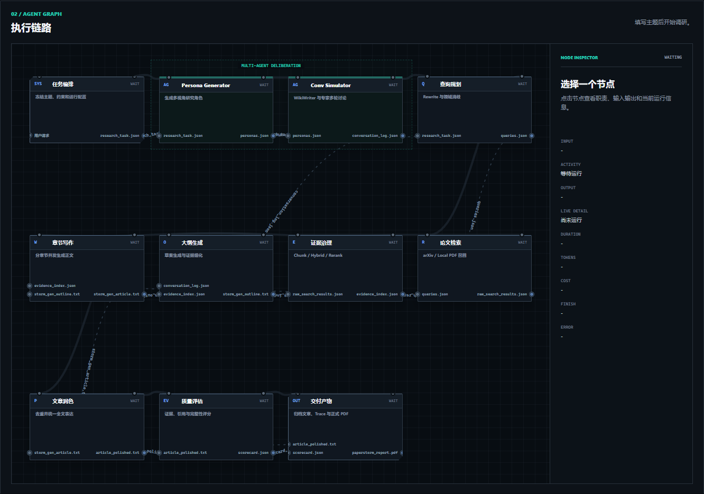
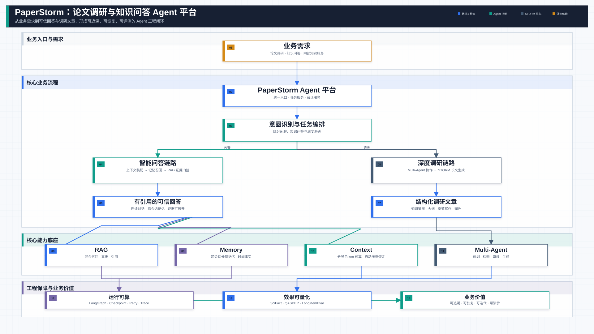
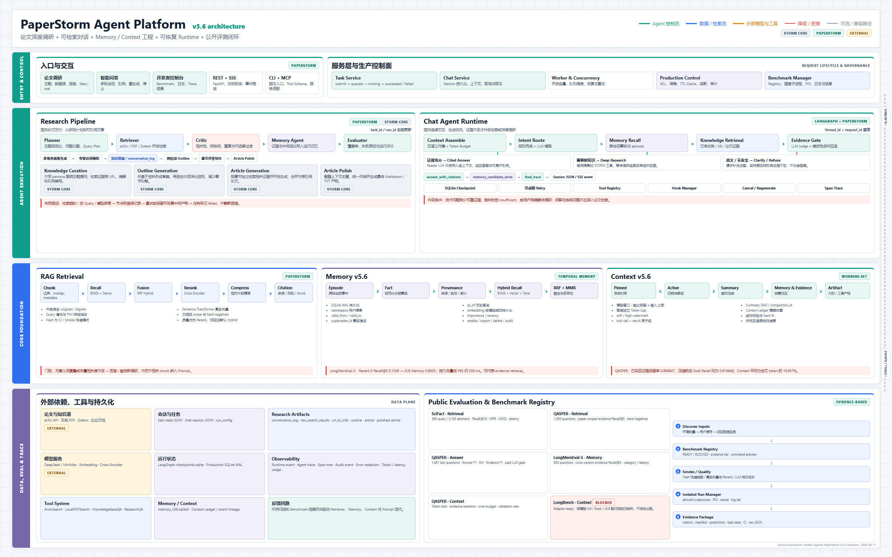
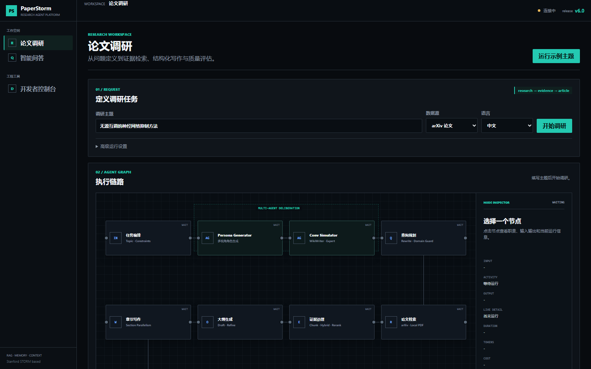
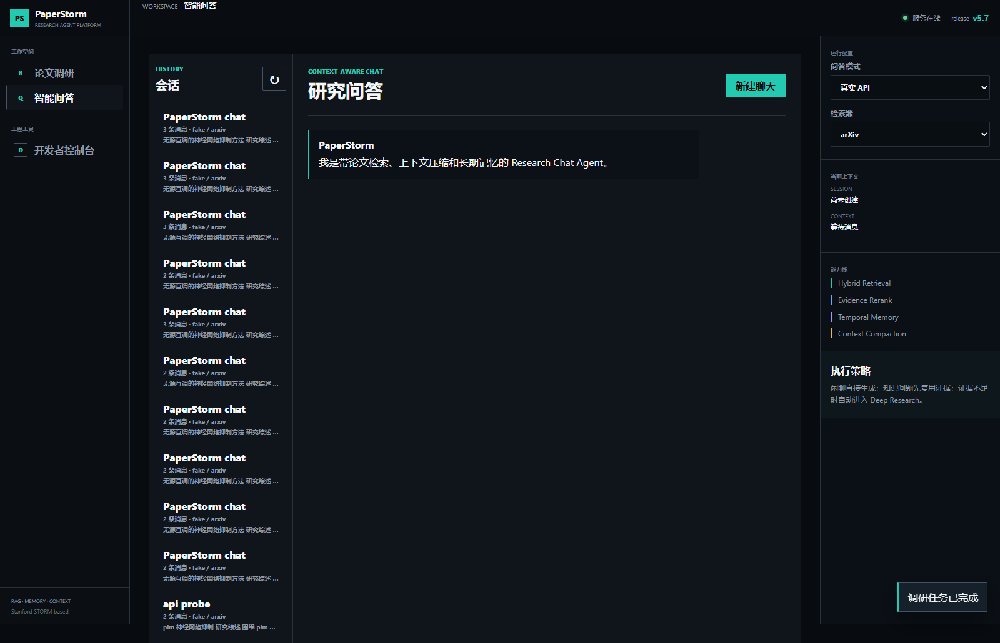
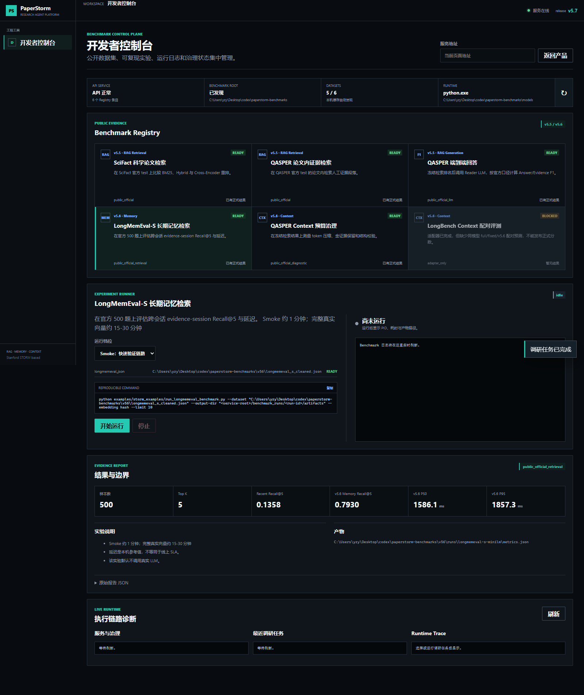

# PaperStorm Agent（v6.2）

> 基于 Stanford STORM 二次开发的论文调研与知识问答 Agent 平台。v6.2 将阶段执行、
> 文件依赖与运行遥测汇入同一张可观测工作流图，并补齐消息级 Token/耗时、原始论文
> 元数据引用，以及支持 LaTeX 公式的正式 PDF 交付。



**论文调研** · **智能问答** · **混合检索** · **长期记忆** · **上下文治理** ·
**Multi-Agent Research** · **公开 Benchmark** · **Langfuse Observability**

## 项目一眼看懂

PaperStorm 不是从零重写聊天机器人，而是在 Stanford STORM 的 Deep Research /
长文生成框架上做工程化增强，把"论文调研脚本"推进成一个可演示、可评测、可治理的
Agent 平台原型：

- **RAG 检索链路**：arXiv / 本地 PDF / Zotero 论文检索，query 清洗、PIM 领域消歧、
  BM25 + Dense + RRF 混合召回、可选 Cross-Encoder 重排、引用回答。
- **Agent Runtime v6.0**：LLM 规划 `respond / tool_call / clarify`，工具能力为
  `memory.search / evidence.search / research.start`；输出形式不再被硬编码成“闲聊、
  故事”等有限意图。LangGraph 负责状态转移、SQLite checkpoint、节点级重试和 span trace。
- **Context v5.9**：Pinned / Active / Summary / Memory / Evidence / Artifact
  六类工作集，按 chat / QA / research 动态分配预算；128K / 256K / 512K 软工作集
  共享 DeepSeek V4 1M 硬窗口，支持结构化递归摘要和 `compaction_id` 精确恢复。
- **Memory v5.6**：SQLite WAL 规范化存储 episode / fact / source provenance /
  entity / audit event，事实带 `valid_from / valid_to / supersedes_id` 支持历史
  `as_of` 查询，检索融合 BM25、真实 embedding、entity、time、importance/recency、
  RRF 与 MMR。聊天可选择轻量 FTS/BM25 或真实 SentenceTransformer 语义召回；
  Hash embedding 仅允许用于离线测试，不会伪装成语义检索。
- **生产治理**：SQLite WAL 控制面，ACL / 审计 / 事务幂等 / TTL 缓存 / 持久任务 /
  熔断 / 层级 span。
- **v5.8 可观测性**：Research / Chat / Benchmark 统一 Trace 模型，本地 JSONL
  镜像与 Langfuse 可选双写；递归脱敏、用户 ID 哈希、失败降级、Trace Score 回传。
- **工作台**：调研模式释放右侧配置栏；节点显示输入、当前活动、输出、耗时、
  Token、费用、结束原因和错误；粗曲线表达执行顺序，细曲线表达带文件名的产物流，
  仅在运行和传递时提供方向流动光效。开发者控制台注册
  SciFact、QASPER、LongMemEval-S 与 Context Pareto 实验。

## v6.2 核心变化

| 原因 | 旧行为造成的问题 | v6.2 改动 | 当前结果 |
| --- | --- | --- | --- |
| 单一进度条无法表达依赖 | 看得到阶段先后，但看不到具体文件从哪里产生、被谁消费 | 11 节点工作流拆分粗执行曲线与细产物曲线；输入/输出圆点绑定文件名，多输入节点使用独立端口 | 等待、运行、完成、失败状态可区分；运行主线和正在传递的文件线独立高亮并流动 |
| 卡片缺少实时诊断 | 无法沿节点定位输入、输出、耗时、Token、费用和错误 | SSE 阶段事件与 `artifact_ready` 事件共同驱动卡片检查器 | 点击任意卡片可查看职责与脱敏运行信息，完成后卡片顶部保留耗时 |
| 聊天回复缺少成本反馈 | 用户无法判断每轮对话的时间和上下文开销 | 用户消息与助手消息持久化消息级 Token、耗时及估算标识，并增加本地头像 | 会话恢复后仍保留同一份遥测信息 |
| 引用与 PDF 丢失论文身份 | 页面只显示生成段落，公式或来源不适合正式交付 | 引用保留原始标题、作者与年份；LaTeX 转 MathML，失败时保留可见公式源码 | 网页与 PDF 均能追溯原论文，中文、表格、代码和公式可打印 |

## v6.1 核心变化

| 原因 | 旧行为造成的问题 | v6.1 改动 | 当前结果 |
| --- | --- | --- | --- |
| 前端猜测调研进度 | 提交后同时点亮 Persona、对话和检索；模型连接失败也会被误报为检索失败 | STORM Callback 与 Runner 边界统一输出 `stage_start/progress/end/error` | 任意时刻只有真实阶段运行，错误落到发生故障的卡片 |
| 卡片只有笼统状态 | 无法判断节点收到了什么、产出了什么或为何失败 | 卡片检查器展示脱敏输入、输出摘要、活动、耗时、Token、费用和类型化错误 | 调试可直接沿 SSE Trace 定位，不再依赖终端猜测 |
| 文章只能下载 Markdown | 对外展示和打印不方便，公式排版没有稳定交付格式 | Markdown 与 LaTeX 转为打印 HTML/MathML，再由 Edge/Chromium 输出并用 pypdf 验证 | 可选生成 `paperstorm_report.pdf`，交付卡片和文章区均可打开 |
| PDF 交付与调研状态耦合 | 渲染器问题可能掩盖已成功生成的文章 | PDF 使用独立交付状态和错误码 | PDF 失败时 Markdown 仍保留，调研任务保持成功 |

在论文调研的“交付产物”卡片中勾选**同时生成正式 PDF**，再开始调研。任务完成后，
卡片和文章区会出现**查看 PDF**入口。Windows 默认自动使用 Microsoft Edge；也可通过
`PAPERSTORM_PDF_BROWSER` 指定 Chromium 可执行文件。

## v6.0 核心变化

| 原因 | 旧行为造成的问题 | v6.0 改动 | 当前结果 |
| --- | --- | --- | --- |
| 把内容类型当成路由枚举 | 新增写作形式就要扩充 intent；失败时可能回退成自我介绍 | LLM 输出动作、工具调用与响应契约，旧 intent 仅作兼容视图 | 普通生成不受有限内容标签约束，工具边界明确 |
| 固定输出上限 | 长文和续写可能在半句处结束 | 按短答、知识回答、详细回答、创作续写动态分配 2K-16K，显式长度最高 64K；`finish_reason=length` 自动续接一次 | 避免为所有请求支付大输出预算，同时降低长内容截断概率 |
| 模型异常被当作普通回复 | 用户看到“你好/我是 PaperStorm”，无法判断真实故障 | 统一返回 timeout、rate_limit、authentication、provider_unavailable、provider_error | 前端与 Trace 可定位失败类型，会话状态仍保留 |
| Memory dense 边界不清 | Hash 向量可能被误解为真实语义效果 | 默认 lexical；semantic 必须加载真实 SentenceTransformer，显式拒绝 Hash provider | 运行配置可选择，报告包含 retrieval mode 与 embedding backend |
| 节点图只有 WAIT/RUN/DONE | 无法判断输入、耗时和成本 | SSE Trace 归一化为节点遥测，完成节点显示耗时徽标 | UI 契约测试已覆盖字段与状态动画 |
| Context/Memory 缺少同条件端到端对比 | 只能看单点召回指标，不能做质量/成本决策 | 新增 128K/256K/512K Pareto 与 LongMemEval-S Reader/Judge 三模式评测 | Harness 与 checkpoint 已通过离线测试；付费全量分数待正式运行 |

完整设计边界、动态预算和复现实验命令见
[v6.0 Agent Harness 发布说明](docs/PAPERSTORM_V60_AGENT_HARNESS.md)。

## 最终能力地图与系统架构图

### 业务总览：核心流程与项目价值



这张图用于汇报和项目介绍：从业务需求进入统一 Agent 平台，经意图编排分流到
智能问答或深度调研，再由 RAG、Memory、Context 与 Multi-Agent 能力支撑，最终形成
可信回答、结构化文章和可量化的工程闭环。

[编辑 Draw.io 源文件](docs/architecture/paperstorm-executive-overview-v57.drawio) ·
[下载 PNG](docs/architecture/paperstorm-executive-overview-v57.png)

### Agent 详细流程：协作链路与算法底座


这张图用于技术讲解和系统评审：左侧是数据源、模型与工具，中间展开 Chat Agent 与
Research Agent 两条执行链，并保留原 STORM 的 Persona Generator、WikiWriter、
TopicExpert、ConvSimulator、Knowledge Curation、两阶段 Outline、章节写作与润色；
右侧说明 RAG、Memory、Context、Runtime 和工程治理算法，底部连接公开评测反馈闭环。

[编辑 Draw.io 源文件](docs/architecture/paperstorm-agent-system-flow-v57.drawio) ·
[下载 PNG](docs/architecture/paperstorm-agent-system-flow-v57.png)

<details>
<summary>展开技术全景附录</summary>



[在浏览器中打开技术全景源文件](docs/architecture/paperstorm-system-architecture.html)

</details>

## 官方 STORM 基础架构（本项目基础）

```text
STORM Workflow -> PaperStorm Runtime -> Service/Dashboard
```

PaperStorm 保留 Stanford STORM 的多角色调研、提纲、写作与润色工作流，在其外层叠加
可恢复 Runtime（LangGraph + SQLite checkpoint）、生产控制面（ACL/幂等/审计/span）
与网页端（产品双模式 + 公开评测工作台）。

## 快速开始

### 环境要求

- Python 3.10 或 3.11（当前发布验证范围；不支持 Python 3.12+）
- 可选：真实检索与 LLM 路由需要网络与 API key（DeepSeek/MiniMax）
- 可选：公开 Benchmark 数据与模型缓存，统一放在仓库外目录
  （默认自动检查 `~/Desktop/codex/paperstorm-benchmarks`）

### 安装

```bash
git clone <your-repo-url> paperstorm
cd paperstorm
pip install -e .
```

`pip install -e .` 会读取 `requirements.txt`，无需再重复执行
`pip install -r requirements.txt`。

### 启动服务

```powershell
# 在项目根目录运行；默认真实模式需要 API Key
python examples/storm_examples/start_paperstorm_service.py `
  --service-root ./results/paperstorm_demo_service `
  --host 127.0.0.1 `
  --port 8002
```

打开 <http://127.0.0.1:8002>。默认进入"论文调研"并使用真实检索与 LLM；填写主题后
点击"开始调研"即可执行任务创建、论文检索、大纲、文章与评分链路。"高级运行设置"
可切换为本地可复现演示；左侧"开发者控制台"进入公开评测工作台。

启动脚本自带 preflight：缺 uvicorn 时给出 `pip install uvicorn`，端口 8002 被
占用时自动建议并顺延到 8003，未配置 DeepSeek/MiniMax Key 时提示真实模式所需的
环境变量。本地可复现演示不调用真实检索与 LLM，只用于离线验证。

底层调试时也可直接启动 FastAPI 应用：

```powershell
python -m uvicorn examples.storm_examples.paperstorm_service_api:app `
  --host 127.0.0.1 `
  --port 8002
```

### 常用环境变量

| 变量 | 说明 |
| --- | --- |
| `PAPERSTORM_RETRIEVAL_STACK` | `auto` / `v41` / `legacy`，运行时检索栈（默认 auto→v41） |
| `PAPERSTORM_RETRIEVAL_EMBEDDING` | `auto`（默认 real）/ `hash`，真实向量 vs 快速本地向量 |
| `PAPERSTORM_RETRIEVAL_MODE` | `hybrid`（默认）/ `bm25` / `dense` / `hybrid_rerank` |
| `PAPERSTORM_RETRIEVAL_INDEX_CACHE_SIZE` | 运行时检索索引 LRU 容量（默认 16） |
| `PAPERSTORM_ROUTER_CACHE_SIZE` | 意图路由 LLM 响应 LRU 容量（默认 512） |
| `PAPERSTORM_CHAT_LLM` | 聊天回复 LLM：`1` 显式开启 / `0` 关闭；paperstorm 模式自动开启 |
| `PAPERSTORM_JUDGE_LLM` | 证据裁判 LLM：`1` 显式开启 / `0` 关闭；paperstorm 模式自动开启 |
| `PAPERSTORM_ZOTERO_ROOT` | Zotero 数据目录，用于真实论文评测 |
| `PAPERSTORM_MODEL_CACHE` | sentence-transformers 模型缓存目录 |
| `PAPERSTORM_BENCHMARK_ROOT` | SciFact/QASPER/LongMemEval 等公开评测数据根目录；未设置时自动检查 `~/Desktop/codex/paperstorm-benchmarks` 与 `data/benchmarks` |
| `PAPERSTORM_TEST_OFFLINE` | 测试默认 `1`：禁止外网、真实 LLM 和模型下载；仅显式设置 `0` 才允许联网测试 |
| `PAPERSTORM_OBSERVABILITY` | 设置为 `langfuse` 启用远程 Trace；未设置时仅写本地 JSONL |
| `LANGFUSE_PUBLIC_KEY` / `LANGFUSE_SECRET_KEY` | Langfuse 项目凭据；仅在启用远程 Trace 时需要 |
| `LANGFUSE_BASE_URL` | Langfuse Cloud 区域或自部署地址 |
| `LANGFUSE_TRACING_ENVIRONMENT` | `development` / `staging` / `production`，用于隔离环境 |

### Langfuse 可观测与评测

Langfuse 是可选依赖，不影响默认安装：

```powershell
pip install -e ".[observability]"
$env:PAPERSTORM_OBSERVABILITY="langfuse"
$env:LANGFUSE_PUBLIC_KEY="pk-lf-..."
$env:LANGFUSE_SECRET_KEY="sk-lf-..."
$env:LANGFUSE_BASE_URL="https://cloud.langfuse.com"
$env:LANGFUSE_TRACING_ENVIRONMENT="development"
```

启动 PaperStorm 后，调研、聊天和网页 Benchmark 会自动产生 Trace。开发者控制台的
`LANGFUSE` 状态卡显示 `已配置 / 本地模式 / 降级`；“已配置”表示 SDK 与凭据就绪，
不虚构异步采集端已经完成网络握手。状态接口为
`GET /observability/status`。本地事件始终写入
`<service-root>/observability/events.jsonl`，即使 SDK 未安装、网络中断或 Langfuse
不可用，Agent 主链路也不会失败。

Trace 映射如下：

| PaperStorm 执行 | Langfuse Trace / Observation | 自动 Score |
| --- | --- | --- |
| 一次论文调研 | `paperstorm.research` → `research_pipeline` | `run_score` / `run_success` |
| 一轮聊天 | `paperstorm.chat` → LangGraph executed nodes | `trajectory_success` / `retrieval_triggered` |
| 一次公开评测 | `paperstorm.benchmark` | metrics.json 中全部数值指标与 `run_success` |

所有输入、输出和 metadata 在上报前递归脱敏：API Key、Authorization、Cookie、密码与
Token 替换为掩码，用户标识转换为稳定 SHA-256 伪匿名 ID，长字符串截断。生产环境仍应
优先使用自部署 Langfuse，并根据企业数据制度决定是否上报原始问题和论文片段。

实现边界、故障降级与评测方法见
[Langfuse 可观测性设计与学习记录](docs/langfuse-observability-v58.md)。

## 前端功能图文说明

### 1. 论文调研模式（默认工作台）



- 调研文章支持一键**下载 Markdown**；勾选交付卡片中的 PDF 选项后，还可生成并
  打开经过页数与正文校验的 `paperstorm_report.pdf`。
- 输入主题后一次点击完成任务创建、运行、状态追踪和结果刷新；节点图展开任务编排、
  Persona、Multi-Agent 讨论、查询规划、论文检索、证据治理、大纲、写作、润色、
  评估与交付。运行节点和连线具有实时光效，点击节点可检查职责、输入、输出和状态。
- 默认 paperstorm 模式调用真实 arXiv/PDF 检索与 LLM；fake 仅用于离线可复现测试。
- 支持数据源（arXiv / 本地 PDF）、输出语言（中文 / 原文）、期望与排除关键词。

### 2. 智能问答模式



- 输入即问答：普通聊天/系统问题直接回复，技术问题优先复用已有调研任务，
  证据不足自动启动深度调研；说"请记住：…"保存跨会话记忆。
- **会话列表**：左侧历史会话可一键切换加载，显示消息数与最近内容摘要。
- **引用展开**：每条带证据的回答可展开引用明细（标题 / 来源链接 / 页码 / 片段），
  无来源的引用明确标记"失效"。
- **重新生成 / 停止**：可对最后一条回答重新生成（旧回答保留为 v1，新回答标 v2，
  不覆盖历史）；生成中可点"停止"中止后续阶段写入。
- 会话栏默认使用 paperstorm 真实检索+LLM，也可显式切换 fake 本地演示与检索器
  （arxiv / local-pdf）。
- 每条回复标注运行时与检索栈（如 `langgraph-v4.4`、`v41`），可追溯执行链路。

### 3. 开发者控制台与公开评测工作台



- 左侧导航的"开发者控制台"将公开评测与运行诊断从用户产品界面分离。
- Benchmark Registry 只发布 v5.5/v5.6 证据：SciFact、QASPER Retrieval、
  QASPER Answer F1、LongMemEval-S 与 QASPER Context；旧 synthetic 分数不再提供
  网页入口。
- 自动发现 `PAPERSTORM_BENCHMARK_ROOT` 或
  `%USERPROFILE%\Desktop\codex\paperstorm-benchmarks`，逐项显示 READY / BLOCKED、
  真实本地路径、证据等级和已有正式结果。
- Smoke / Quality 两档通过受控子进程运行；网页可查看可复现命令、PID、状态、日志、
  指标、结果路径并停止任务；付费 QASPER Answer 需要显式确认且必须提供 API Key。

> 说明：旧版"本地文档知识库"独立页面已并入开发侧工具链，不再作为用户页独立入口，
> 避免三处问答互相重复；聊天问答是唯一的交互式问答入口。

## 核心实现

### 检索链路

运行时默认使用 V4.1 栈：`BM25（rank-bm25，中英混合 unigram/bigram）+ Dense + RRF`，
可选 Cross-Encoder 二次重排；带"有意义相关度门槛"（词/CJK 大词重叠或强向量相似度），
无关问题会拒答而不是编造。真实向量模型可用时自动启用（`auto→real`），
`hash` 为无模型快速模式。核心实现见 `PaperStormRAGIndex` / `HybridPaperIndex`。

### Context v5.9（已接入聊天）

Pinned / Active / Recursive Summary / Retrieved Memory / Evidence / Artifact 六类
工作集；DeepSeek V4 使用 1M token 硬上限，但日常聊天、证据问答和深度调研分别采用
128K、256K、512K 软工作集，避免每轮无差别填满窗口。各层先获得任务相关目标份额，
空闲预算再按优先级借给 Active 或 Evidence，并受绝对上限保护。达到 78% 软水位时触发
结构化递归摘要，保留否定条件、数值、路径、错误、引用 ID、主题切换和待办；原始事件
仍可按 `compaction_id` 恢复。摘要候选按当前问题的 BM25 风格相关性选取，不再固定只取
最后两条。

### Memory v5.6（已接入聊天）

SQLite WAL 规范化存储 episode、fact、source provenance、entity 与 audit event；
事实更新保留 `valid_from/valid_to/supersedes_id`，支持历史 `as_of` 查询；检索融合
BM25、真实 embedding、entity、time、importance/recency、RRF 与 MMR。v4.3 API 由
兼容 facade 保留（`Memory v4.3` 契约测试仍保留）。

### 会话历史、长期记忆与证据边界

- **Session Recall** 保存完整消息到 SQLite WAL，FTS5 BM25 跨会话检索，中文无空格文本
  使用 n-gram 子串兜底，并回填命中消息前后文；只允许同一用户范围内召回。
- **Long-term Memory** 只存稳定偏好、用户事实、明确决定和可复用流程。真实模式由 LLM
  输出结构化候选，规则负责禁止项、置信度、去重、时效和审计；fake 模式保留确定性规则。
- **Evidence** 存论文和文档中的外部事实，保留 source / document / chunk / citation
  provenance，经 BM25 + Dense + RRF 和可选 Rerank 召回，不写入用户长期记忆。

因此“之前聊过的 PIM 论文”先从 Session Recall 找到旧会话和引用指针，再按需去
Evidence 取论文原文；用户偏好则从 Long-term Memory 取。三者不会混成一个向量池。

### LangGraph v4.4（已接入聊天）

`classify → memory_recall → knowledge_retrieval → evidence_grade →
deep_research → answer_with_citations → memory_candidate_write → final_trace`，
SQLite checkpointer 持久化（一次聊天产生多个 checkpoint）、节点级瞬时故障重试、
span trace、`storm_deep_research` 隔离工具。

### Production v4.5（已接入聊天）

每条聊天/调研请求外层都走 SQLite WAL 控制面：tenant/resource ACL、审计、
事务幂等（相同载荷重放复用结果）、TTL+tag 缓存、持久任务、熔断、层级 span。

### Turn Planner：LLM 主决策 + 规则故障兜底

`run_mode=paperstorm` 默认由 DeepSeek Turn Planner 根据最近 24 条消息、相关摘要、
长期记忆和当前请求输出结构化 action / retrieval / tool / working_subject；旧 topic 不再
自动注入并否决 LLM 决策。仅在 LLM 不可用、超时或 JSON 解析失败时回退规则。
`fake` 模式仍使用纯规则，保证离线测试完全可复现且不产生 API 费用。

**回复策略是"生成优先、答不了才检索"**：聊天类消息默认直接由 LLM 生成自然回复；
只有当 LLM 明确表示需要检索或消息明显是调研请求时，才升级到知识检索 / 深度调研。

**证据充分性由"LLM 证据裁判"判定**：有 key 时自动启用，裁判认为证据不足就升级到
深度调研；无 LLM 时用保守的确定性判定（实质词重叠 + 会话主题锚点相关）。

### 缓存

- LLM 调用层：`functools.lru_cache`；litellm 磁盘缓存改为显式 opt-in，避免 import
  阶段写入用户目录导致服务启动失败。
- 运行时检索索引：进程内 LRU（默认 16），文件变化自动失效。
- 意图路由 LLM：prompt 级 LRU（默认 512）。
- 治理缓存：SQLite TTL + tag 失效（数据变更驱动，非 LRU）。

## Benchmark：公开评测与口径

### 能力矩阵

| 能力 | 公开数据与指标 | 当前定位 |
| --- | --- | --- |
|  **Retrieval** | SciFact / QASPER；Recall、MRR、nDCG、P95 | BM25、Dense、Hybrid、Hybrid + Rerank 同口径对比 |
|  **Answer** | QASPER；Answer F1、EM、Evidence F1 | 冻结检索结果后评估 Reader，区分召回问题与生成问题 |
|  **Memory** | LongMemEval-S；Evidence Recall@5、P50/P95 | 跨会话长期记忆检索；不冒充端到端答案准确率 |
|  **Context** | QASPER Context；证据保留率、预算率、压缩比 | 验证压缩是否丢失已召回证据与结构完整性 |

开发者控制台从本地 `PAPERSTORM_BENCHMARK_ROOT` 自动发现数据与历史结果，按
`READY / BLOCKED` 显示运行条件，并提供可复制命令、实时日志、PID、结果路径与停止操作。

### 评测原则

所有对外数字均来自**公开、可复现的数据集**，并按证据等级报告：

- **public-official**：SciFact / QASPER 官方 split，使用官方 evaluator 对拍；
- **public-official-retrieval-only**：LongMemEval-S evidence retrieval，不含
  reader LLM，不等同于端到端答案准确率；
- **diagnostic**：QASPER Context 预算与证据保留诊断，不评价生成答案质量。

口径约定：`n` 为题数，`split` 为官方划分，`Top-K` 明确列出；test 一旦用于冻结报告
就不再参与调参；延迟为冷建索引后的单机 CPU warm-query 参考值，不代表线上 SLA；
小样本结果给出 Bootstrap 95% CI。

### 主结果 1：LongMemEval-S 长期记忆检索（v5.6）

官方 cleaned-2025-09，500/500 题，Top-5。该结果只衡量 evidence session retrieval，
**不等同于 reader LLM 的端到端答案准确率**。

| 方法 | Recall@5 | P50 | P95 |
| --- | ---: | ---: | ---: |
| Recent 5 sessions | 0.1358 | 0 ms | 0 ms |
| v5.6 Memory，hash 协议基线 | 0.4813 | 146.8 ms | 202.6 ms |
| v5.6 Memory，paraphrase-multilingual-MiniLM-L12-v2（向量持久化） | **0.8003** | 218.1 ms | 359.3 ms |

v5.6 在写入时一次性编码事实并持久化向量（SQLite `memory_fact_vectors`，按模型指纹
隔离），查询只编码 query、按主键取向量，不再逐查询重编码全部 session：与早期
`0.7930 / P95 1857ms` 相比，Recall@5 提升到 `0.8003`，P95 降到 `359.3ms`
（-80.6%）。LongBench adapter/paired scorer 已通过离线测试，官方数据下载因外部
网络中断未完成，因此不声称 LongBench task score。

### 主结果 2：QASPER Context 预算治理（v5.6）

复用官方 QASPER test 1309 条真实 Hybrid+Rerank Top-5 排名；8K 模型窗口、1536 输出
预留、Evidence 层预算 70%。

| 指标 | 结果 |
| --- | ---: |
| 题数 | 1309 |
| 已召回 evidence 保留率 | **0.999847** |
| Gold evidence recall（装配前 / 后） | **0.618648 / 0.618648** |
| 平均 Context / 完整论文 token 比 | **0.166570** |
| Context token P50 | 554 |
| 超预算率 / 结构校验失败率 | **0 / 0** |

结论：当前预算下 Context 没有进一步损害上游金证据召回，并把完整论文输入缩减到
平均 16.657%。这是 Context 保真诊断，不是生成答案准确率。

### 主结果 3：公开论文检索 Benchmark（v5.5）

**SciFact 官方 test**：5,183 篇科学摘要、300 条官方 query、Top-10。

| 方法 | Recall@10 | MRR@10 | nDCG@10 | P95 query |
| --- | ---: | ---: | ---: | ---: |
| BM25 | 0.7592 | 0.6069 | 0.6395 | 42.2 ms |
| Dense | 0.7857 | 0.6071 | 0.6492 | 20.5 ms |
| Hybrid | 0.8114 | 0.6298 | 0.6687 | 67.8 ms |
| Hybrid + Rerank | **0.8379** | **0.6659** | **0.7001** | 2733.5 ms |

**QASPER 官方 test**：19,914 段论文段落、1,309 条有人工 evidence 的问题、Top-5；
按问题所属论文 scoped 检索，保留同论文非证据段落作为 hard negatives。

| 方法 | Evidence Recall@5 | MRR@5 | nDCG@5 | P95 query |
| --- | ---: | ---: | ---: | ---: |
| BM25 | 0.4279 | 0.3714 | 0.3396 | 0.34 ms |
| Dense | 0.4771 | 0.4527 | 0.4026 | 14.5 ms |
| Hybrid | 0.5057 | 0.4595 | 0.4155 | 15.3 ms |
| Hybrid + Rerank | **0.6186** | **0.5802** | **0.5327** | 1316.7 ms |

Rerank 排序质量最高，但 CPU P95 达 1.3~2.7 秒，超过低延迟预算；因此**质量最优配置
是 Hybrid+Rerank，低延迟部署默认是 Hybrid**。质量与延迟联合选型，而不是只看一个
nDCG 数字。

### 主结果 4：QASPER 端到端 Answer F1（v5.5）

冻结 Hybrid+Rerank Top-5 与 `deepseek/deepseek-chat` 后，在全部官方 test 问题上
运行一次（test 不再调参），并使用数据集自带 `qasper_evaluator.py` 对拍：

| split | 问题数 | 成功率 | Answer F1 | Exact Match | Evidence F1 |
| --- | ---: | ---: | ---: | ---: | ---: |
| validation | 1,005 | 100% | 0.4722 | 0.2428 | 0.5025 |
| test | 1,451 | 100% | **0.5441** | **0.3274** | **0.5814** |

检索与生成分开评测：Recall/MRR/nDCG 判断"有没有找到证据"，Answer F1 判断"找到证据后
是否答对"。Boolean 与不可答问题表现较好，Abstractive F1（0.2651）是主要短板。

### 付费协议运行（1/4 规模，2026-08-10）

在正式全量付费实验前，先按 **1/4 协议规模** 完成两组长上下文实验（DeepSeek
`deepseek-chat`，温度 0，逐题 checkpoint，成本约 $1.1）：

**LongMemEval-S 端到端问答（125/500）**：复用 v5.6 持久化 Memory 检索 Top-5 会话
作为证据，reader 生成答案。证据 Recall@5 `0.8075`，整体 EM `0.256`；分类型看，
单会话问答 EM `0.4286`，多会话推理 EM `0.0364` —— 检索证据足够，但多会话跨 session
推理是当前主要瓶颈（与头尾截断的证据表示有关）。该运行使用非官方 token-F1/EM 判分，
不能与官方 LongMemEval Judge 直接对比。

| 维度 | 结果 |
| --- | ---: |
| 成功 / 总题数 | 125 / 125 |
| Evidence Recall@5 | 0.8075 |
| 单会话问答 EM / F1 | 0.4286 / 0.5303 |
| 多会话推理 EM / F1 | 0.0364 / 0.0622 |
| 成本估算 | $0.34 |

**QASPER full-paper vs v5.6 预算上下文（validation 251 题）**：同一批问题分别用
整篇论文段落与 v5.6 预算装配上下文生成，250 条成功配对：

| 指标 | full | v5.6 | Δ |
| --- | ---: | ---: | ---: |
| Answer F1 | 0.5383 | 0.5399 | +0.002 |
| Exact Match | 0.2590 | 0.2550 | -0.004 |
| Evidence F1 | 0.5732 | 0.5674 | -0.006 |
| Prompt tokens | 1,453,417 | 1,306,984 | -10.1% |

结论：v5.6 上下文在全部指标上保持在 2pp 质量预算内（"压缩不丢证据"成立）；
但 QASPER validation 论文大多能装进 6656 token 预算，平均只省 10% 输入，
50% 削减目标需要真正超预算的长文（见 QASPER Context 诊断的 16.7% 全论文口径）。
完整逐题数据见
[docs/benchmarks/paperstorm_v56_paid_quarter_summary.json](docs/benchmarks/paperstorm_v56_paid_quarter_summary.json)。

### 如何复现

数据与模型缓存放在仓库外（`PAPERSTORM_BENCHMARK_ROOT`），仓库只保存 adapter、
测试、小型 fixture 与聚合报告：

```powershell
# SciFact 官方 test 检索（含 5000 次 Bootstrap 95% CI）
python examples/storm_examples/run_paperstorm_public_benchmark.py `
  --benchmark scifact --download `
  --cache-dir <external-cache> `
  --output-dir results/public_benchmarks/v55_scifact_real `
  --split test --modes bm25 dense hybrid hybrid_rerank `
  --embedding real --model sentence-transformers/all-MiniLM-L6-v2 `
  --reranker --reranker-model cross-encoder/ms-marco-MiniLM-L-6-v2 `
  --top-k 10 --bootstrap-samples 5000 --seed 55

# QASPER 官方 test 证据检索
python examples/storm_examples/run_paperstorm_public_benchmark.py `
  --benchmark qasper --cache-dir <external-cache> `
  --output-dir results/public_benchmarks/v55_qasper_test_real `
  --split test --modes bm25 dense hybrid hybrid_rerank `
  --embedding real --model sentence-transformers/all-MiniLM-L6-v2 `
  --reranker --reranker-model cross-encoder/ms-marco-MiniLM-L-6-v2 `
  --top-k 5 --bootstrap-samples 5000 --seed 55

# QASPER 端到端 Answer F1（需 API Key，断点续跑）
python examples/storm_examples/run_qasper_answer_benchmark.py `
  --split test `
  --retrieval-predictions results/public_benchmarks/v55_qasper_test_real/predictions.jsonl `
  --output-dir results/public_benchmarks/v55_qasper_answer_test_real `
  --cache-dir <external-cache> --top-k 5

# LongMemEval-S 长期记忆检索（500 题）
python examples/storm_examples/run_longmemeval_benchmark.py `
  --dataset <longmemeval_s_cleaned.json> `
  --output-dir <external-cache>/v56/longmemeval-real `
  --embedding sentence-transformer --top-k 5

# QASPER Context 预算与证据保留诊断
python examples/storm_examples/run_qasper_context_benchmark.py `
  --dataset <qasper-test-v0.3.json> `
  --rankings results/public_benchmarks/v55_qasper_test_real/predictions.jsonl `
  --output-dir <external-cache>/v56/runs/qasper-context-v56

# 1/4 付费协议运行（需 API Key，可断点续跑）
python examples/storm_examples/run_longmemeval_answer_benchmark.py `
  --dataset <longmemeval_s_cleaned.json> --memory-root <persisted-memory> `
  --output-dir <external-cache>/v56/runs/longmemeval-answer-quarter --limit 125
python examples/storm_examples/run_qasper_answer_benchmark.py `
  --split validation --retrieval-predictions <validation-rankings.jsonl> `
  --output-dir <external-cache>/v56/runs/qasper-context-quarter/full `
  --limit 251 --context-mode full
python examples/storm_examples/run_qasper_answer_benchmark.py `
  --split validation --retrieval-predictions <validation-rankings.jsonl> `
  --output-dir <external-cache>/v56/runs/qasper-context-quarter/v56 `
  --limit 251 --context-mode v56 --input-budget-tokens 6656
```

网页端开发者控制台可运行所有输入已就绪的 Benchmark；缺少配对预测的 LongBench 会
明确显示 `BLOCKED`，不会伪造分数。

### 历史与审计

更早的 synthetic seed 回归（0.99 级 Recall 与同分布生成规则高度相关）与本地真实论文
候选实验（v5.2 / v5.4，含文档级 dev/test 隔离与人工审核门禁）不再作为主结果发布，
完整审计记录保留在
[docs/PAPERSTORM_V54_EVALUATION.md](docs/PAPERSTORM_V54_EVALUATION.md) 与
[docs/PAPERSTORM_V55_PUBLIC_BENCHMARKS.md](docs/PAPERSTORM_V55_PUBLIC_BENCHMARKS.md)
中，仅供回归与追溯。

## 设计借鉴来源

Claude Code（上下文分层 / MCP / 工作流）、Hermes（会话搜索 / Context Compressor）、
Anthropic Contextual Retrieval / Context Engineering、MemGPT（虚拟内存与按需分页）、
Mem0 / Graphiti（episode provenance、时间有效事实）、Stanford STORM。逐条对照与
相关实现均在对应模块、测试与公开评测记录中给出，可按下方目录直接定位和复现。

## 目录结构

```text
knowledge_storm/
  paperstorm_retrieval_v41.py        # BM25+Dense+RRF 检索栈
  paperstorm_context_v56.py          # 六类 Context 与递归 compaction lineage
  paperstorm_memory_v56.py           # SQLite temporal memory 与混合召回
  paperstorm_session_recall.py       # FTS5 BM25 跨会话历史检索
  paperstorm_langgraph_v44.py        # LangGraph 会话运行时
  paperstorm_production_v45.py       # SQLite WAL 生产控制面
  paperstorm_benchmarks.py           # 公开 Benchmark 契约与指标
  paperstorm_intent_router.py        # Action Planner（规则护栏+LLM）
  evaluation/public_benchmarks/      # BEIR / QASPER / LongMemEval adapter
examples/storm_examples/             # FastAPI 服务 / MCP server / 评测 CLI
frontend/paperstorm_dashboard/       # 网页端 Dashboard（两模式 + 评测工作台）
tests/                               # 离线单元、API、前端契约与发布完整性测试
docs/                                # 评测记录 / Benchmark 口径 / 截图
```

v5.9 的边界定义、根因分析和逐项验收见
[Memory、Context 与 Agent Planner 改进记录](docs/PAPERSTORM_V59_CONTEXT_MEMORY.md)。

## 版本演进

| 版本 | 主题 | 关键产物 |
| --- | --- | --- |
| v0.1 → v1.2 | MVP → Final Packaging | `run_paperstorm_release_demo.py` |
| v2.0 → v3.2 | Research QA / RAG Memory / Intent Router / Knowledge Base | 检索问答、记忆与压缩基线 |
| v4.0 → v4.5 | 混合检索、可恢复 Context、可治理 Memory、LangGraph、生产治理 | 历史架构主线 |
| v5.0 Cyclone | 生成优先聊天、LLM 证据裁判、主题锚点判定 | 历史版本 |
| v5.2 Evaluation Integrity | 真实论文文档级 holdout、冻结 test、Bootstrap CI | 历史版本 |
| v5.4 Trustworthy Evaluation | 人工门禁、质量/延迟联合选型 | 历史版本 |
| v5.5 Public Benchmarks | SciFact / QASPER 公开评测、官方 evaluator 对拍 | 公开检索与 Answer F1 |
| v5.6 Memory & Context | SQLite temporal memory、五层 Context、LongMemEval-S、QASPER Context 诊断 | 当前算法与评测底座 |
| v5.7 Workspace | 直角深色工作台、Visio 风格架构图、Benchmark 能力矩阵与正式截图 | 历史版本 |
| v5.8 Observability | Langfuse 可选双写、统一 Trace/Span/Score、递归脱敏与 fail-open 降级 | 历史版本 |
| v5.8.1 Citation Fix | 原始论文来源回填、历史会话兼容迁移、文章段落锚点定位 | 历史版本 |
| v5.9 Context & Agent Graph | LLM-first Turn Planner、跨会话 FTS5、结构化压缩、1M 模型窗口适配、实时节点执行图 | 历史版本 |
| v6.0 Action & Evaluation | Action Planner、动态输出续接、显式 LLM 错误、真实语义记忆开关、节点遥测、Context Pareto、LongMemEval-S E2E | 历史版本 |
| v6.1 Stage Trace & PDF Delivery | 真实阶段事件、精确故障归因、节点输入输出与成本检查器、可选正式 PDF 交付 | 历史版本 |
| **v6.2 Observable Workflow** | 执行流与产物流双层曲线、多输入文件端口、消息级遥测、原始论文引用与公式 PDF | 当前版本 |

## License

MIT（原 STORM 为 MIT License，见 [LICENSE](LICENSE)）。
