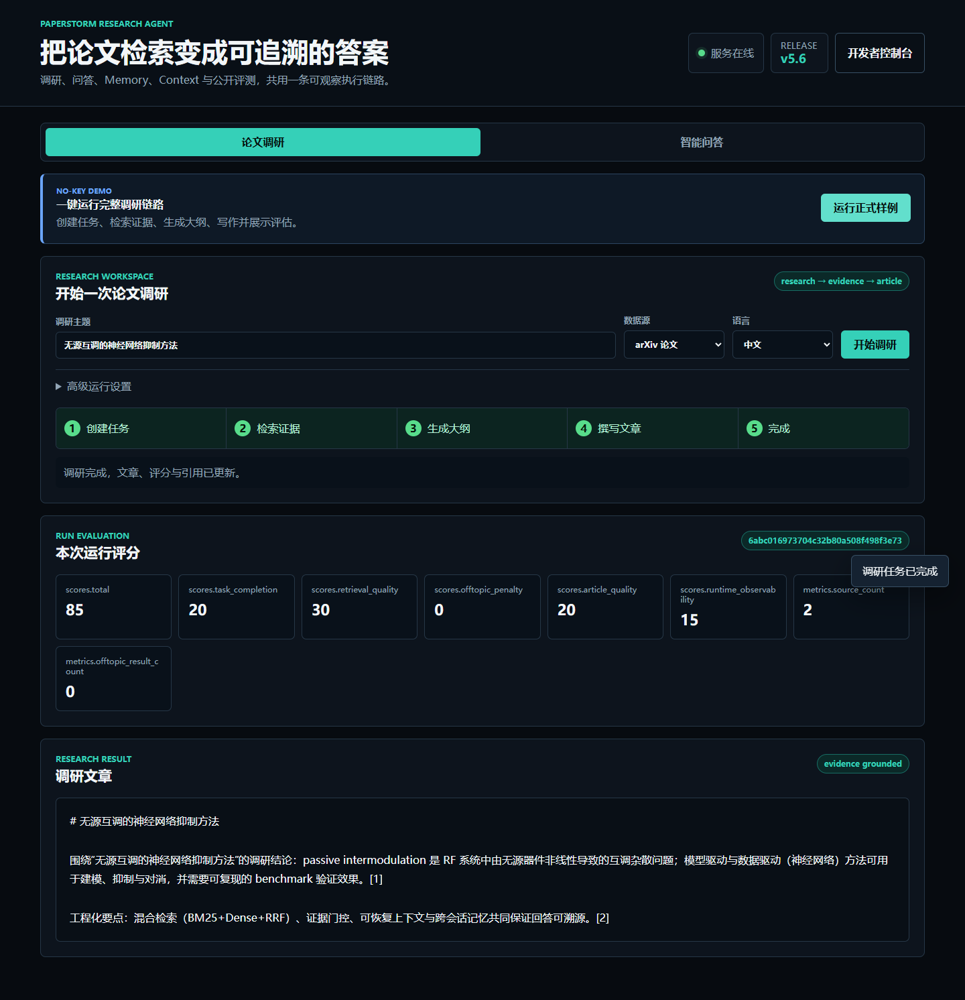
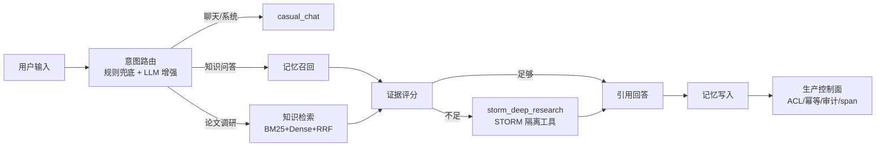
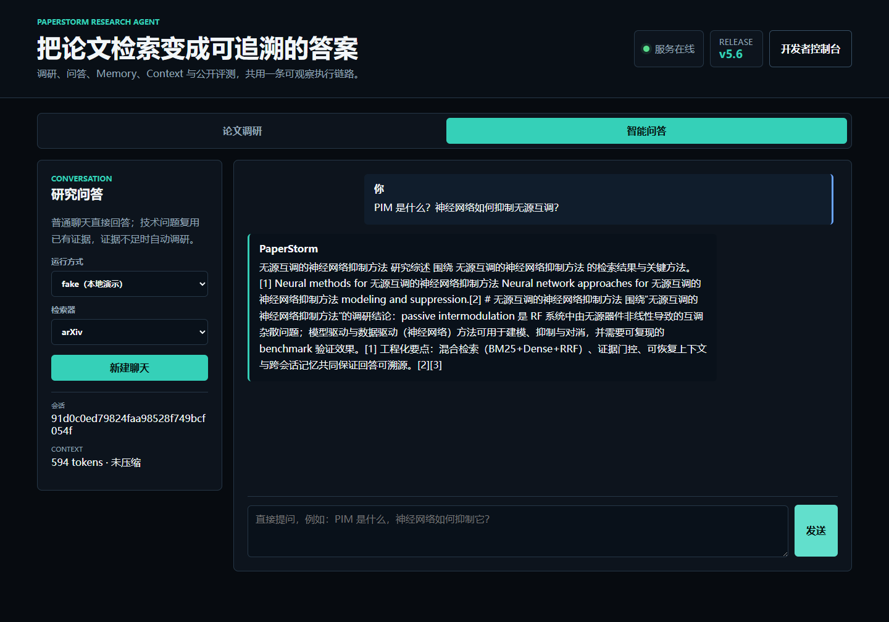
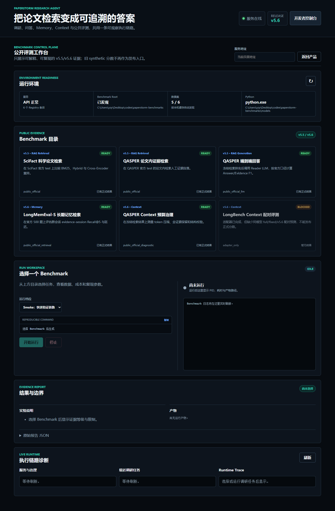

# PaperStorm Agent（v5.6）

> 基于 Stanford STORM 二次开发的中文论文调研与知识库 Agent。v5.6 重点完成
> Memory / Context 工程化重构与公开 Benchmark 评测：所有对外指标均来自公开、
> 可复现的数据集（SciFact、QASPER、LongMemEval-S），按证据等级与口径如实报告，
> 不再使用 synthetic 分数作为发布入口。



## 项目一眼看懂

PaperStorm 不是从零重写聊天机器人，而是在 Stanford STORM 的 Deep Research /
长文生成框架上做工程化增强，把"论文调研脚本"推进成一个可演示、可评测、可治理的
Agent 平台原型：

- **RAG 检索链路**：arXiv / 本地 PDF / Zotero 论文检索，query 清洗、PIM 领域消歧、
  BM25 + Dense + RRF 混合召回、可选 Cross-Encoder 重排、引用回答。
- **Agent Runtime**：LangGraph 状态图编排（意图分类 → 记忆 → 检索 → 证据门控 →
  深度调研 → 引用回答），SQLite checkpoint、节点级重试、span trace。
- **Context v5.6**：Pinned / Active / 递归 Summary / Memory & Evidence / Artifact
  五层工作集，typed token budget、tool call/result 原子组、summary DAG、按
  `compaction_id` 精确恢复。
- **Memory v5.6**：SQLite WAL 规范化存储 episode / fact / source provenance /
  entity / audit event，事实带 `valid_from / valid_to / supersedes_id` 支持历史
  `as_of` 查询，检索融合 BM25、真实 embedding、entity、time、importance/recency、
  RRF 与 MMR。
- **生产治理**：SQLite WAL 控制面，ACL / 审计 / 事务幂等 / TTL 缓存 / 持久任务 /
  熔断 / 层级 span。
- **网页端**：面向用户的产品界面（论文调研 / 智能问答两种模式）与面向开发的
  公开评测工作台分离，一键运行全部 Benchmark。

## 最终能力地图



## 官方 STORM 基础架构（本项目基础）

```text
STORM Workflow -> PaperStorm Runtime -> Service/Dashboard
```

PaperStorm 保留 Stanford STORM 的多角色调研、提纲、写作与润色工作流，在其外层叠加
可恢复 Runtime（LangGraph + SQLite checkpoint）、生产控制面（ACL/幂等/审计/span）
与网页端（产品双模式 + 公开评测工作台）。

## 快速开始

### 环境要求

- Python 3.10 或 3.11（当前发布验证范围；不支持 Python 3.12+）
- 可选：真实检索与 LLM 路由需要网络与 API key（DeepSeek/MiniMax）
- 可选：公开 Benchmark 数据与模型缓存，统一放在仓库外目录
  （默认自动检查 `~/Desktop/codex/paperstorm-benchmarks`）

### 安装

```bash
git clone <your-repo-url> paperstorm
cd paperstorm
pip install -e .
```

`pip install -e .` 会读取 `requirements.txt`，无需再重复执行
`pip install -r requirements.txt`。

### 启动服务

```powershell
# 在项目根目录运行；fake 正式样例不需要 API Key
python examples/storm_examples/start_paperstorm_service.py `
  --service-root ./results/paperstorm_demo_service `
  --host 127.0.0.1 `
  --port 8002
```

打开 <http://127.0.0.1:8002>。默认进入"论文调研"，点击"运行正式样例"即可在
一次点击内完成 fake 任务创建、检索、大纲、文章与评分展示；真实链路在
"高级运行设置"中选择"真实检索与 LLM"。右下/右上"开发者控制台"进入公开评测工作台。

底层调试时也可直接启动 FastAPI 应用：

```powershell
python -m uvicorn examples.storm_examples.paperstorm_service_api:app `
  --host 127.0.0.1 `
  --port 8002
```

### 常用环境变量

| 变量 | 说明 |
| --- | --- |
| `PAPERSTORM_RETRIEVAL_STACK` | `auto` / `v41` / `legacy`，运行时检索栈（默认 auto→v41） |
| `PAPERSTORM_RETRIEVAL_EMBEDDING` | `auto`（默认 real）/ `hash`，真实向量 vs 快速本地向量 |
| `PAPERSTORM_RETRIEVAL_MODE` | `hybrid`（默认）/ `bm25` / `dense` / `hybrid_rerank` |
| `PAPERSTORM_RETRIEVAL_INDEX_CACHE_SIZE` | 运行时检索索引 LRU 容量（默认 16） |
| `PAPERSTORM_ROUTER_CACHE_SIZE` | 意图路由 LLM 响应 LRU 容量（默认 512） |
| `PAPERSTORM_CHAT_LLM` | 聊天回复 LLM：`1` 显式开启 / `0` 关闭；paperstorm 模式自动开启 |
| `PAPERSTORM_JUDGE_LLM` | 证据裁判 LLM：`1` 显式开启 / `0` 关闭；paperstorm 模式自动开启 |
| `PAPERSTORM_ZOTERO_ROOT` | Zotero 数据目录，用于真实论文评测 |
| `PAPERSTORM_MODEL_CACHE` | sentence-transformers 模型缓存目录 |
| `PAPERSTORM_BENCHMARK_ROOT` | SciFact/QASPER/LongMemEval 等公开评测数据根目录；未设置时自动检查 `~/Desktop/codex/paperstorm-benchmarks` 与 `data/benchmarks` |
| `PAPERSTORM_TEST_OFFLINE` | 测试默认 `1`：禁止外网、真实 LLM 和模型下载；仅显式设置 `0` 才允许联网测试 |

## 前端功能图文说明

### 1. 论文调研模式（默认）


- 输入主题后一次点击完成任务创建、运行、状态追踪和结果刷新；五阶段进度
  （创建任务 → 检索证据 → 生成大纲 → 撰写文章 → 完成）明确显示当前位置。
- fake 模式快速生成可复现示例结果；paperstorm 模式调用真实 arXiv/PDF 检索与 LLM。
- 支持数据源（arXiv / 本地 PDF）、输出语言（中文 / 原文）、期望与排除关键词。

### 2. 智能问答模式



- 输入即问答：普通聊天/系统问题直接回复，技术问题优先复用已有调研任务，
  证据不足自动启动深度调研；说"请记住：…"保存跨会话记忆。
- 会话栏可切换运行模式（fake 本地演示 / paperstorm 真实检索+LLM）与检索器
  （arxiv / local-pdf）。
- 每条回复标注运行时与检索栈（如 `langgraph-v4.4`、`v41`），可追溯执行链路。

### 3. 开发者控制台与公开评测工作台



- 右上角"开发者控制台"将公开评测与运行诊断从用户产品界面分离。
- Benchmark Registry 只发布 v5.5/v5.6 证据：SciFact、QASPER Retrieval、
  QASPER Answer F1、LongMemEval-S 与 QASPER Context；旧 synthetic 分数不再提供
  网页入口。
- 自动发现 `PAPERSTORM_BENCHMARK_ROOT` 或
  `%USERPROFILE%\Desktop\codex\paperstorm-benchmarks`，逐项显示 READY / BLOCKED、
  真实本地路径、证据等级和已有正式结果。
- Smoke / Quality 两档通过受控子进程运行；网页可查看可复现命令、PID、状态、日志、
  指标、结果路径并停止任务；付费 QASPER Answer 需要显式确认且必须提供 API Key。

> 说明：旧版"本地文档知识库"独立页面已并入开发侧工具链，不再作为用户页独立入口，
> 避免三处问答互相重复；聊天问答是唯一的交互式问答入口。

## 核心实现

### 检索链路

运行时默认使用 V4.1 栈：`BM25（rank-bm25，中英混合 unigram/bigram）+ Dense + RRF`，
可选 Cross-Encoder 二次重排；带"有意义相关度门槛"（词/CJK 大词重叠或强向量相似度），
无关问题会拒答而不是编造。真实向量模型可用时自动启用（`auto→real`），
`hash` 为无模型快速模式。核心实现见 `PaperStormRAGIndex` / `HybridPaperIndex`。

### Context v5.6（已接入聊天）

Pinned / Active / Recursive Summary / Retrieved Memory & Evidence / Artifact 五层
工作集；typed token budget、tool call/result 原子选择、soft/high watermark、
summary DAG、失败回退，并按 `compaction_id` 恢复原始事件。v4.2 API 由兼容 facade
保留（`Context v4.2` 契约测试仍保留）。

### Memory v5.6（已接入聊天）

SQLite WAL 规范化存储 episode、fact、source provenance、entity 与 audit event；
事实更新保留 `valid_from/valid_to/supersedes_id`，支持历史 `as_of` 查询；检索融合
BM25、真实 embedding、entity、time、importance/recency、RRF 与 MMR。v4.3 API 由
兼容 facade 保留（`Memory v4.3` 契约测试仍保留）。

### LangGraph v4.4（已接入聊天）

`classify → memory_recall → knowledge_retrieval → evidence_grade →
deep_research → answer_with_citations → memory_candidate_write → final_trace`，
SQLite checkpointer 持久化（一次聊天产生多个 checkpoint）、节点级瞬时故障重试、
span trace、`storm_deep_research` 隔离工具。

### Production v4.5（已接入聊天）

每条聊天/调研请求外层都走 SQLite WAL 控制面：tenant/resource ACL、审计、
事务幂等（相同载荷重放复用结果）、TTL+tag 缓存、持久任务、熔断、层级 span。

### 意图路由：规则兜底 + LLM 增强

`run_mode=paperstorm` 默认启用 LLM 路由（DeepSeek），`fake` 模式默认纯规则；
LLM 决策需置信度 ≥ 0.65 且不能与高置信规则冲突，解析失败/超时自动回退规则。

**回复策略是"生成优先、答不了才检索"**：聊天类消息默认直接由 LLM 生成自然回复；
只有当 LLM 明确表示需要检索或消息明显是调研请求时，才升级到知识检索 / 深度调研。

**证据充分性由"LLM 证据裁判"判定**：有 key 时自动启用，裁判认为证据不足就升级到
深度调研；无 LLM 时用保守的确定性判定（实质词重叠 + 会话主题锚点相关）。

### 缓存

- LLM 调用层：`functools.lru_cache` + litellm 磁盘缓存。
- 运行时检索索引：进程内 LRU（默认 16），文件变化自动失效。
- 意图路由 LLM：prompt 级 LRU（默认 512）。
- 治理缓存：SQLite TTL + tag 失效（数据变更驱动，非 LRU）。

## Benchmark：公开评测与口径

### 评测原则

所有对外数字均来自**公开、可复现的数据集**，并按证据等级报告：

- **public-official**：SciFact / QASPER 官方 split，使用官方 evaluator 对拍；
- **public-official-retrieval-only**：LongMemEval-S evidence retrieval，不含
  reader LLM，不等同于端到端答案准确率；
- **diagnostic**：QASPER Context 预算与证据保留诊断，不评价生成答案质量。

口径约定：`n` 为题数，`split` 为官方划分，`Top-K` 明确列出；test 一旦用于冻结报告
就不再参与调参；延迟为冷建索引后的单机 CPU warm-query 参考值，不代表线上 SLA；
小样本结果给出 Bootstrap 95% CI。

### 主结果 1：LongMemEval-S 长期记忆检索（v5.6）

官方 cleaned-2025-09，500/500 题，Top-5。该结果只衡量 evidence session retrieval，
**不等同于 reader LLM 的端到端答案准确率**。

| 方法 | Recall@5 | P50 | P95 |
| --- | ---: | ---: | ---: |
| Recent 5 sessions | 0.1358 | 0 ms | 0 ms |
| v5.6 Memory，hash 协议基线 | 0.4813 | 146.8 ms | 202.6 ms |
| v5.6 Memory，all-MiniLM-L6-v2 CPU | **0.7930** | 1586.1 ms | 1857.3 ms |

真实向量质量明显更高，但当前按 query 编码全部 session 导致 P95 偏高，下一步是
预计算 embedding 与 ANN 索引。LongBench adapter/paired scorer 已通过离线测试，
官方数据下载因外部网络中断未完成，因此不声称 LongBench task score。

### 主结果 2：QASPER Context 预算治理（v5.6）

复用官方 QASPER test 1309 条真实 Hybrid+Rerank Top-5 排名；8K 模型窗口、1536 输出
预留、Evidence 层预算 70%。

| 指标 | 结果 |
| --- | ---: |
| 题数 | 1309 |
| 已召回 evidence 保留率 | **0.999847** |
| Gold evidence recall（装配前 / 后） | **0.618648 / 0.618648** |
| 平均 Context / 完整论文 token 比 | **0.166570** |
| Context token P50 | 554 |
| 超预算率 / 结构校验失败率 | **0 / 0** |

结论：当前预算下 Context 没有进一步损害上游金证据召回，并把完整论文输入缩减到
平均 16.657%。这是 Context 保真诊断，不是生成答案准确率。

### 主结果 3：公开论文检索 Benchmark（v5.5）

**SciFact 官方 test**：5,183 篇科学摘要、300 条官方 query、Top-10。

| 方法 | Recall@10 | MRR@10 | nDCG@10 | P95 query |
| --- | ---: | ---: | ---: | ---: |
| BM25 | 0.7592 | 0.6069 | 0.6395 | 42.2 ms |
| Dense | 0.7857 | 0.6071 | 0.6492 | 20.5 ms |
| Hybrid | 0.8114 | 0.6298 | 0.6687 | 67.8 ms |
| Hybrid + Rerank | **0.8379** | **0.6659** | **0.7001** | 2733.5 ms |

**QASPER 官方 test**：19,914 段论文段落、1,309 条有人工 evidence 的问题、Top-5；
按问题所属论文 scoped 检索，保留同论文非证据段落作为 hard negatives。

| 方法 | Evidence Recall@5 | MRR@5 | nDCG@5 | P95 query |
| --- | ---: | ---: | ---: | ---: |
| BM25 | 0.4279 | 0.3714 | 0.3396 | 0.34 ms |
| Dense | 0.4771 | 0.4527 | 0.4026 | 14.5 ms |
| Hybrid | 0.5057 | 0.4595 | 0.4155 | 15.3 ms |
| Hybrid + Rerank | **0.6186** | **0.5802** | **0.5327** | 1316.7 ms |

Rerank 排序质量最高，但 CPU P95 达 1.3~2.7 秒，超过低延迟预算；因此**质量最优配置
是 Hybrid+Rerank，低延迟部署默认是 Hybrid**。质量与延迟联合选型，而不是只看一个
nDCG 数字。

### 主结果 4：QASPER 端到端 Answer F1（v5.5）

冻结 Hybrid+Rerank Top-5 与 `deepseek/deepseek-chat` 后，在全部官方 test 问题上
运行一次（test 不再调参），并使用数据集自带 `qasper_evaluator.py` 对拍：

| split | 问题数 | 成功率 | Answer F1 | Exact Match | Evidence F1 |
| --- | ---: | ---: | ---: | ---: | ---: |
| validation | 1,005 | 100% | 0.4722 | 0.2428 | 0.5025 |
| test | 1,451 | 100% | **0.5441** | **0.3274** | **0.5814** |

检索与生成分开评测：Recall/MRR/nDCG 判断"有没有找到证据"，Answer F1 判断"找到证据后
是否答对"。Boolean 与不可答问题表现较好，Abstractive F1（0.2651）是主要短板。

### 如何复现

数据与模型缓存放在仓库外（`PAPERSTORM_BENCHMARK_ROOT`），仓库只保存 adapter、
测试、小型 fixture 与聚合报告：

```powershell
# SciFact 官方 test 检索（含 5000 次 Bootstrap 95% CI）
python examples/storm_examples/run_paperstorm_public_benchmark.py `
  --benchmark scifact --download `
  --cache-dir <external-cache> `
  --output-dir results/public_benchmarks/v55_scifact_real `
  --split test --modes bm25 dense hybrid hybrid_rerank `
  --embedding real --model sentence-transformers/all-MiniLM-L6-v2 `
  --reranker --reranker-model cross-encoder/ms-marco-MiniLM-L-6-v2 `
  --top-k 10 --bootstrap-samples 5000 --seed 55

# QASPER 官方 test 证据检索
python examples/storm_examples/run_paperstorm_public_benchmark.py `
  --benchmark qasper --cache-dir <external-cache> `
  --output-dir results/public_benchmarks/v55_qasper_test_real `
  --split test --modes bm25 dense hybrid hybrid_rerank `
  --embedding real --model sentence-transformers/all-MiniLM-L6-v2 `
  --reranker --reranker-model cross-encoder/ms-marco-MiniLM-L-6-v2 `
  --top-k 5 --bootstrap-samples 5000 --seed 55

# QASPER 端到端 Answer F1（需 API Key，断点续跑）
python examples/storm_examples/run_qasper_answer_benchmark.py `
  --split test `
  --retrieval-predictions results/public_benchmarks/v55_qasper_test_real/predictions.jsonl `
  --output-dir results/public_benchmarks/v55_qasper_answer_test_real `
  --cache-dir <external-cache> --top-k 5

# LongMemEval-S 长期记忆检索（500 题）
python examples/storm_examples/run_longmemeval_benchmark.py `
  --dataset <longmemeval_s_cleaned.json> `
  --output-dir <external-cache>/v56/longmemeval-real `
  --embedding sentence-transformer --top-k 5

# QASPER Context 预算与证据保留诊断
python examples/storm_examples/run_qasper_context_benchmark.py `
  --dataset <qasper-test-v0.3.json> `
  --rankings results/public_benchmarks/v55_qasper_test_real/predictions.jsonl `
  --output-dir <external-cache>/v56/runs/qasper-context-v56
```

网页端开发者控制台可运行所有输入已就绪的 Benchmark；缺少配对预测的 LongBench 会
明确显示 `BLOCKED`，不会伪造分数。

### 历史与审计

更早的 synthetic seed 回归（0.99 级 Recall 与同分布生成规则高度相关）与本地真实论文
候选实验（v5.2 / v5.4，含文档级 dev/test 隔离与人工审核门禁）不再作为主结果发布，
完整审计记录保留在
[docs/PAPERSTORM_V54_EVALUATION.md](docs/PAPERSTORM_V54_EVALUATION.md) 与
[docs/PAPERSTORM_V55_PUBLIC_BENCHMARKS.md](docs/PAPERSTORM_V55_PUBLIC_BENCHMARKS.md)
中，仅供回归与追溯。

## 设计借鉴来源

Claude Code（上下文分层 / MCP / 工作流）、Hermes（会话搜索 / Context Compressor）、
Anthropic Contextual Retrieval / Context Engineering、MemGPT（虚拟内存与按需分页）、
Mem0 / Graphiti（episode provenance、时间有效事实）、Stanford STORM。逐条对照与
差异说明见 [docs/DESIGN_SOURCES.md](docs/DESIGN_SOURCES.md)。

## 目录结构

```text
knowledge_storm/
  paperstorm_retrieval_v41.py        # BM25+Dense+RRF 检索栈
  paperstorm_context_v56.py          # 五层 Context 与递归 compaction lineage
  paperstorm_memory_v56.py           # SQLite temporal memory 与混合召回
  paperstorm_langgraph_v44.py        # LangGraph 会话运行时
  paperstorm_production_v45.py       # SQLite WAL 生产控制面
  paperstorm_benchmarks.py           # 公开 Benchmark 契约与指标
  paperstorm_intent_router.py        # 意图路由（规则+LLM）
  evaluation/public_benchmarks/      # BEIR / QASPER / LongMemEval adapter
examples/storm_examples/             # FastAPI 服务 / MCP server / 评测 CLI
frontend/paperstorm_dashboard/       # 网页端 Dashboard（两模式 + 评测工作台）
tests/                               # 离线单元、API、前端契约与发布完整性测试
docs/                                # 评测记录 / Benchmark 口径 / 截图
```

## 版本演进

| 版本 | 主题 | 关键产物 |
| --- | --- | --- |
| v0.1 → v1.2 | MVP → Final Packaging | `run_paperstorm_release_demo.py` |
| v2.0 → v3.2 | Research QA / RAG Memory / Intent Router / Knowledge Base | 检索问答、记忆与压缩基线 |
| v4.0 → v4.5 | 混合检索、可恢复 Context、可治理 Memory、LangGraph、生产治理 | 历史架构主线 |
| v5.0 Cyclone | 生成优先聊天、LLM 证据裁判、主题锚点判定 | 历史版本 |
| v5.2 Evaluation Integrity | 真实论文文档级 holdout、冻结 test、Bootstrap CI | 历史版本 |
| v5.4 Trustworthy Evaluation | 人工门禁、质量/延迟联合选型 | 历史版本 |
| v5.5 Public Benchmarks | SciFact / QASPER 公开评测、官方 evaluator 对拍 | 公开检索与 Answer F1 |
| **v5.6 Memory & Context** | SQLite temporal memory、五层 Context、LongMemEval-S、QASPER Context 诊断 | 当前版本 |

## License

MIT（原 STORM 为 MIT License，见 [LICENSE](LICENSE)）。
