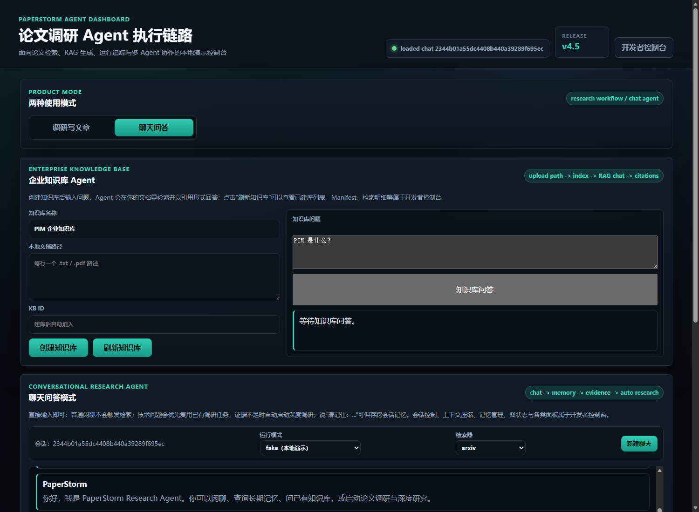
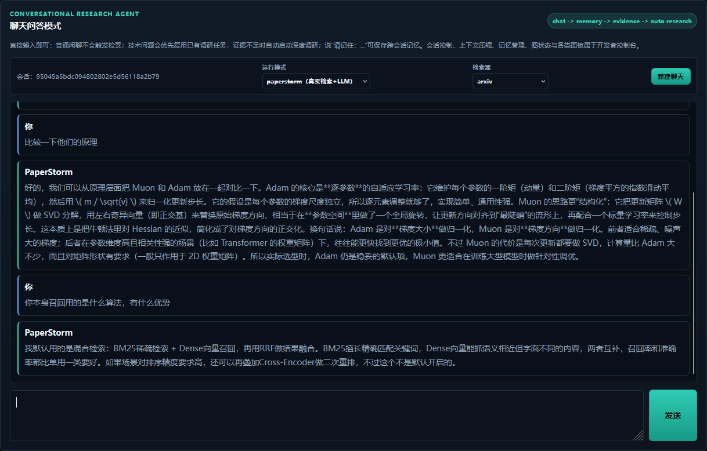
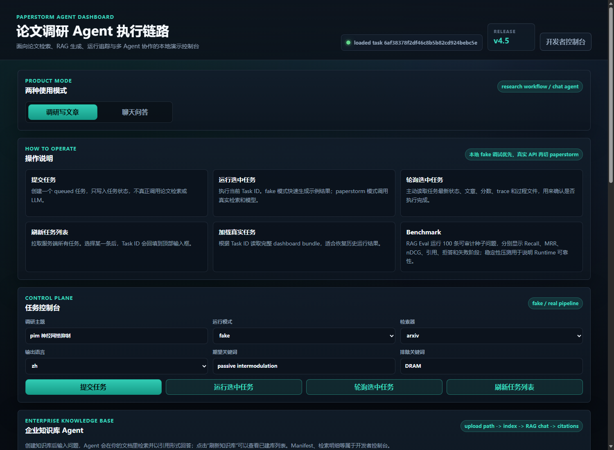
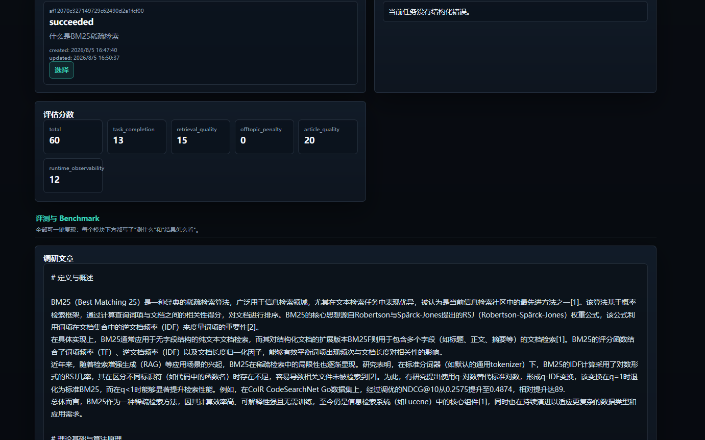
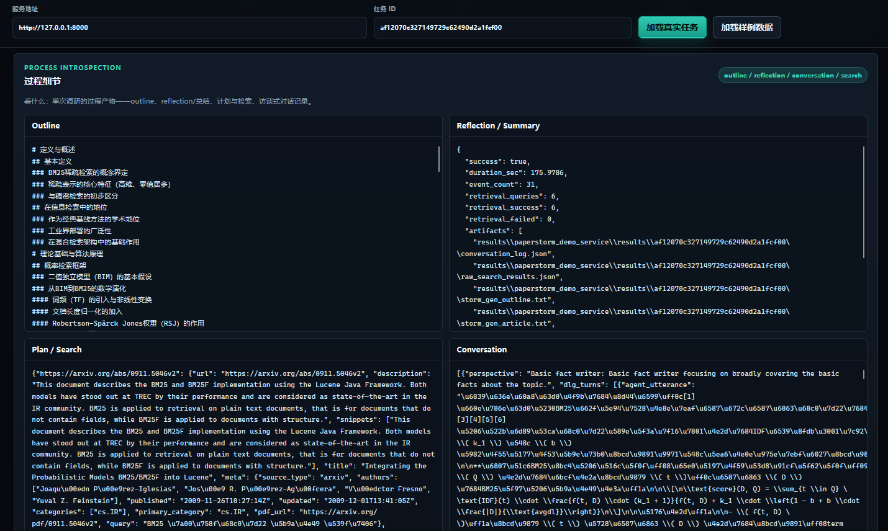
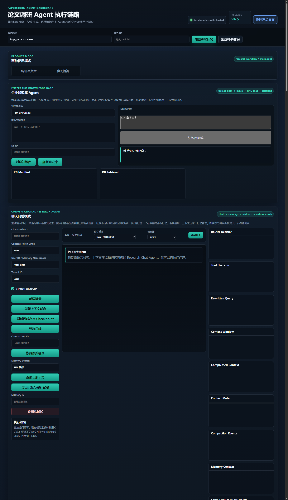
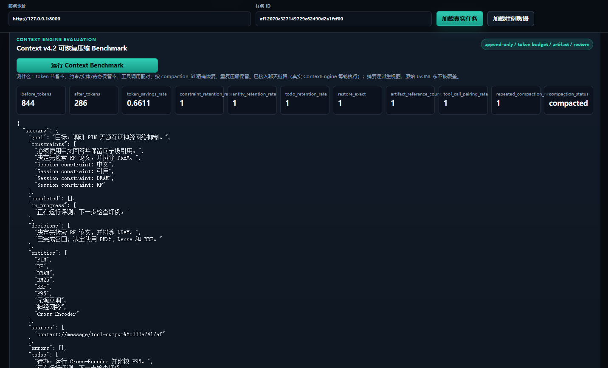
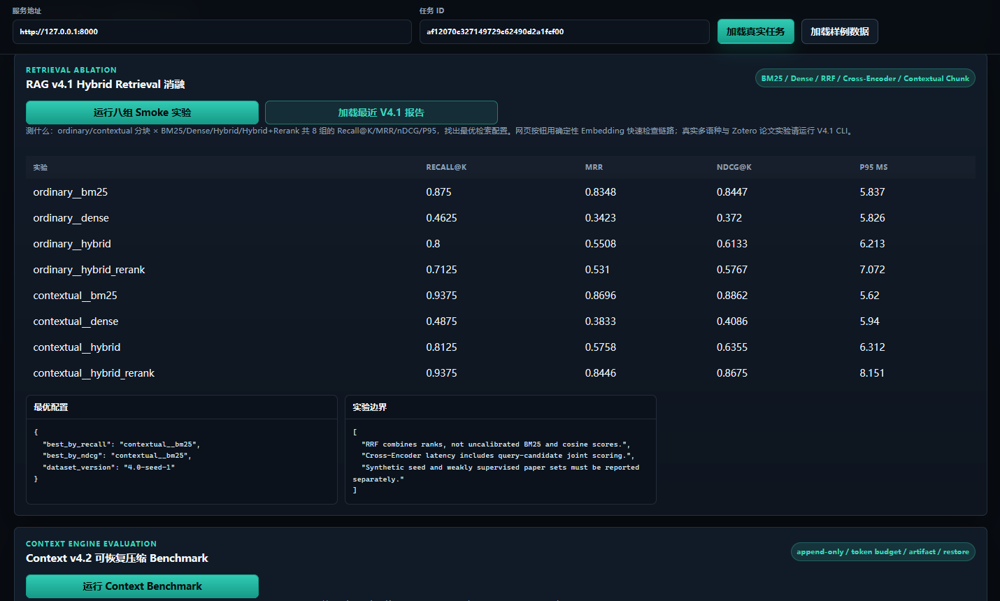
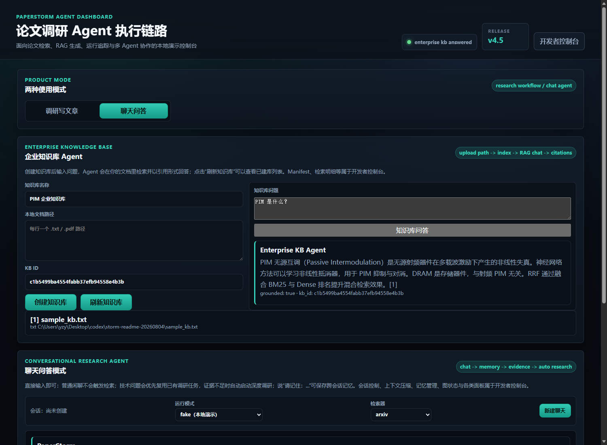

# PaperStorm Agent

> 基于 Stanford STORM 二次开发的中文论文调研与知识库 Agent，面向 RAG、Memory、
> Tool Calling、MCP-style Tools、Multi-Agent、Runtime Trace、Eval Harness 与
> Dashboard 的完整 Agent 工程演示。



## 项目一眼看懂

PaperStorm 不是从零重写聊天机器人，而是在 Stanford STORM 的 Deep Research /
长文生成框架上做工程化增强，把"论文调研脚本"推进成一个可演示、可评测、可治理的
Agent 平台原型：

- **RAG 检索链路**：arXiv / 本地 PDF / Zotero 论文检索，query 清洗、PIM 领域消歧、
  BM25 + Dense + RRF 混合召回、可选 Cross-Encoder 重排、引用回答。
- **Agent Runtime**：LangGraph 状态图编排（意图分类 → 记忆 → 检索 → 证据门控 →
  深度调研 → 引用回答），SQLite checkpoint、节点级重试、span trace。
- **Context / Memory**：可恢复的上下文压缩引擎（v4.2）与可治理的跨会话长期记忆
  （v4.3）。
- **生产治理**：SQLite WAL 控制面，ACL / 审计 / 事务幂等 / TTL 缓存 / 持久任务 /
  熔断 / 层级 span（v4.5）。
- **网页端**：面向用户的产品界面与面向开发的调试控制台分离，一键运行全部
  Benchmark，支持真实检索 + LLM 路由（paperstorm 模式）。

## 最终能力地图


## 官方 STORM 基础架构（本项目基础）

```text
STORM Workflow -> PaperStorm Runtime -> Service/Dashboard
```


## 核心亮点

1. **真实语料 benchmark 优先**：v5.2 从本地 Zotero 读取 40 篇英文论文、868 个
   chunk，构造 46 条中文释义检索 query，按论文划分 34 dev / 12 frozen test；只用
   dev 选择检索配置。Dense 在 test 上 Recall@5=`0.4167`（95% bootstrap CI
   `[0.1667, 0.6667]`），BM25=`0`。这是自动候选标注的小样本 pilot，不冒充专家集。
2. **实现在前、Benchmark 在后**：v4.2/v4.3/v4.4/v4.5 都是先实现并接入真实聊天链路，
  再配契约 Benchmark，不是空壳。
3. **网页端可演示**：聊天模式默认即走完整 LangGraph + 治理链路；开发者控制台可
   一键重跑全部 Benchmark、查看图状态/Checkpoint/Trace/检索对比。
4. **借鉴成熟设计并补短板**：参考 Claude Code 的上下文分层、Hermes 的会话搜索与
   压缩策略，同时用类型/时间冲突、软删除、压缩失败回退补掉它们的已知局限。
   详见 [docs/DESIGN_SOURCES.md](docs/DESIGN_SOURCES.md)。

## 技术栈

`Python 3.10` · `LangGraph` · `DSPy / Stanford STORM` · `FastAPI / SSE` ·
`SQLite WAL` · `rank-bm25` · `sentence-transformers` · `Cross-Encoder` ·
`Pydantic` · `MCP-style JSON-RPC` · `HTML/CSS/JavaScript`

## 快速开始

### 环境要求

- Python 3.10+
- 可选：真实检索与 LLM 路由需要网络与 API key（DeepSeek/MiniMax）

### 安装

```bash
git clone <your-repo-url> paperstorm
cd paperstorm
pip install -e .
pip install -r requirements.txt
```

### 启动服务

```bash
# 本地演示（fake 模式，不需要 API key）
python -m uvicorn examples.storm_examples.paperstorm_service_api:app --port 8002
```

打开 <http://127.0.0.1:8002>，默认进入聊天问答模式。

### 常用环境变量

| 变量 | 说明 |
| --- | --- |
| `PAPERSTORM_RETRIEVAL_STACK` | `auto` / `v41` / `legacy`，运行时检索栈（默认 auto→v41） |
| `PAPERSTORM_RETRIEVAL_EMBEDDING` | `auto`（默认 real）/ `hash`，真实向量 vs 快速本地向量 |
| `PAPERSTORM_RETRIEVAL_MODE` | `hybrid`（默认）/ `bm25` / `dense` / `hybrid_rerank` |
| `PAPERSTORM_RETRIEVAL_INDEX_CACHE_SIZE` | 运行时检索索引 LRU 容量（默认 16） |
| `PAPERSTORM_ROUTER_CACHE_SIZE` | 意图路由 LLM 响应 LRU 容量（默认 512） |
| `PAPERSTORM_CHAT_LLM` | 聊天回复 LLM：`1` 显式开启 / `0` 关闭；paperstorm 模式自动开启 |
| `PAPERSTORM_JUDGE_LLM` | 证据裁判 LLM：`1` 显式开启 / `0` 关闭；paperstorm 模式自动开启 |
| `PAPERSTORM_ZOTERO_ROOT` | Zotero 数据目录，用于真实论文评测 |
| `PAPERSTORM_MODEL_CACHE` | sentence-transformers 模型缓存目录 |

## 前端功能图文说明

### 1. 聊天问答模式（默认）


- 输入即问答：普通聊天/系统问题不会触发检索；技术问题优先复用已有调研任务，
  证据不足自动启动深度调研；说"请记住：…"保存跨会话记忆。
- 会话栏可切换**运行模式**（fake 本地演示 / paperstorm 真实检索+LLM）与**检索器**
  （arxiv / local-pdf）。
- 每条回复标注运行时与检索栈：`paperstorm-production-v5.0`、
  `langgraph-v4.4`、`storm_deep_research_tool` / `v41`。



### 2. 调研写文章模式



- 提交调研主题 → 运行任务 → 轮询状态 → 查看文章 / 评估分数 / trace。
- fake 模式快速生成示例结果；paperstorm 模式调用真实 arXiv/PDF 检索与 LLM。





### 3. 开发者控制台与 Benchmark



- 右上角"开发者控制台"开关，把调试面板与用户产品界面分离。
- 一键运行：RAG v4.0 评测、v4.1 检索消融、Context / Memory / LangGraph /
  Production Benchmark、**检索前后对比**（legacy vs V4.1）。
- 聊天调试：上下文 Meter、压缩事件、记忆召回、图状态与 Checkpoint 历史、Trace。





### 4. 本地文档知识库



- 上传本地文档（.txt/.pdf）建立知识库，基于知识库问答并给出引用；
- **支持从 Zotero 一键导入建库**：不用手动填路径，服务端默认按顺序读取
  `PAPERSTORM_ZOTERO_ROOT` → 项目根目录 `local_zotero_root.txt`（gitignored）→
  `~/Zotero`，也可以在前端手动指定目录和检索词；
- 创建/查询走 v4.5 ACL（tenant/user/resource），文档变更通过 SHA-256 增量索引 +
  tag 缓存失效。

> 入口分工：聊天问答是**唯一的交互式问答入口**（面向当前调研任务的知识库）；
> 本地文档知识库面向你自己上传/导入的文档；只读的"任务知识库问答产物"和
> "文献检索问答"已收进开发者控制台，不再作为独立用户入口，避免三处问答互相重复。

## 核心实现

### 检索：legacy → V4.1

运行时默认使用 V4.1 栈：`BM25（rank-bm25，中英混合 unigram/bigram）+ Dense + RRF`，
可选 Cross-Encoder 二次重排；带"有意义相关度门槛"（词/CJK 大词重叠或强向量相似度），
无关问题会拒答而不是编造。真实向量模型可用时自动启用（`auto→real`），
`hash` 为无模型快速模式。

### Context v4.2（已接入聊天）

append-only 事件存储、token 双阈值、动态预算、工具输出 artifact 化、结构化
handoff 摘要、按 `compaction_id` 精确恢复；原始消息永不被覆盖。

### Memory v4.3（已接入聊天）

候选提取 → 置信度门控 → 去重 → 冲突 supersede → 软删除；namespace ACL、
有效期、BM25/Dense/RRF 混合召回与审计事件。

### LangGraph v4.4（已接入聊天）

`classify → memory_recall → knowledge_retrieval → evidence_grade →
deep_research → answer_with_citations → memory_candidate_write → final_trace`，
SQLite checkpointer 持久化（一次聊天产生多个 checkpoint）、节点级瞬时故障重试、
span trace、`storm_deep_research` 隔离工具。

### Production v4.5（已接入聊天）

每条聊天/调研请求外层都走 SQLite WAL 控制面：tenant/resource ACL、审计、
事务幂等（相同载荷重放复用结果）、TTL+tag 缓存、持久任务、熔断、层级 span。

### 意图路由：规则兜底 + LLM 增强

`run_mode=paperstorm` 默认启用 LLM 路由（DeepSeek），`fake` 模式默认纯规则；
LLM 决策需置信度 ≥ 0.65 且不能与高置信规则冲突（聊天/系统问题不允许被降级为
检索或 clarify，反之亦然），解析失败/超时自动回退规则。

**回复策略是"生成优先、答不了才检索"**：聊天类消息默认直接由 LLM 生成自然回复
（paperstorm 模式且配置 API key 时启用；fake/测试模式保持离线并回退到本地模板）；
只有当 LLM 明确表示需要检索（输出 `__NEED_RESEARCH__` 标记）或消息明显是调研请求时，
才升级到知识检索 / 深度调研，避免"聊什么都是固定话术"。

**证据充分性由"LLM 证据裁判"判定**（模仿 Claude Code / Hermes 的做法：模型读问题+
证据自行判断"能不能答"）：有 key 时自动启用，裁判说"需要更多检索/无法回答"就升级到
深度调研；无 LLM 时用保守的确定性判定——要求问题与证据有**实质词重叠**（词/CJK
大词，过滤"效果/方法"等常用词）**且与会话主题锚点相关**，避免只撞上一个通用词就把
无关知识库当成答案。

### 缓存

- LLM 调用层：`functools.lru_cache(maxsize=3000)` + litellm 磁盘缓存。
- 运行时检索索引：进程内 LRU（默认 16），文件变化自动失效。
- 意图路由 LLM：prompt 级 LRU（默认 512）。
- 治理缓存：SQLite TTL + tag 失效（数据变更驱动，非 LRU）。

## Benchmark：证据等级与功能对比

所有数值可复现，见“如何复现”。v5.2 按证据等级报告，避免把 synthetic、弱标注和
真实冻结测试混成一个“综合提升”。完整实验审计见
[docs/PAPERSTORM_V52_EVALUATION.md](docs/PAPERSTORM_V52_EVALUATION.md)。

### 主结果：真实论文跨语言检索 pilot（v5.2）

- 语料：40 篇本地 Zotero 英文 PDF，868 chunks；其中 23 篇形成 46 条无重复中文 query。
- 协议：按 `document_id` 切分，34 dev / 12 frozen test；BM25 / Dense / Hybrid 只在
  dev 上选型，test 不参与调参；2,000 次 bootstrap 计算 95% CI。
- 模型：`sentence-transformers/paraphrase-multilingual-MiniLM-L12-v2`；Top-K=5。

| frozen test | Recall@5 | MRR | nDCG@5 | P95 单 query 延迟 |
| --- | ---: | ---: | ---: | ---: |
| BM25 | 0.0000 | 0.0000 | 0.0000 | 约 226ms |
| Dense（dev 选出） | 0.4167 | 0.2986 | 0.2463 | 约 227ms |

Recall@5 的 95% CI 为 `[0.1667, 0.6667]`。结论是跨语言语义向量明显优于纯词法
匹配，但样本仍小、query 为自动候选且未完成领域专家审核，**不能宣称生产质量达标**。

### Smoke：synthetic seed（100 条，非主结果）

| 指标 | legacy（实现前） | V4.1（实现后，hash） | V4.1（实现后，真实向量） |
| --- | ---: | ---: | ---: |
| Recall@K | 0.3625 | 0.7750（**+113.8%**） | 0.9875（+172%） |
| MRR | 0.2804 | 0.5510 | 0.8688 |
| nDCG@K | 0.3006 | 0.6075 | 0.8986 |

legacy 在中文查询上按"整段 CJK run"切词导致召回失败，V4.1 的 unigram/bigram
分词 + BM25 + RRF 是主要提升来源。该集合与实现规则高度同分布，仅用于回归和消融，
不应把 `0.9875` 单独写进简历作为真实业务效果。

### 检索（Zotero 真实论文，6 个任务组，337 条弱标注用例）

从本地 Zotero 论文库按主题设计 6 组任务：PIM / VLC / MIMO-OFDM 信道估计 /
NOMA 功率分配 / 非线性与数字预失真 / 神经网络。

| 向量 | legacy Recall@K | V4.1 Recall@K | 说明 |
| --- | ---: | ---: | ---: |
| hash | 0.3775 | 0.3203（-15.2%） | 弱向量下 RRF 受噪声影响 |
| 真实向量 | 0.5958 | 0.5755（-3.4%） | 词面匹配场景两者接近 |

说明：弱标注查询是"论文《X》的『Y』部分主要讨论什么？"，标题/章节词面匹配已
接近饱和，V4.1 的优势主要出现在中文/释义型查询（见 seed 集）；这也解释了为什么
真实向量是质量默认、hash 是速度选项。诚实结论：**检索提升要分场景度量，不能一句
"V4.1 全面更好"带过**。

### 契约 benchmark（小样本，验证机制而非线上效果）

以下指标原先容易被误读为大规模实验。v5.2 明确分母与适用边界：

- Context：1 个构造的 8-message 场景，844→286 tokens（节省 66.11%），验证约束、
  工具配对与 restore；不代表真实长会话平均节省率。
- Memory：4 个写入/冲突/过期/namespace 契约案例，同一检索 query 重放 20 次；
  `100%/0 泄漏` 是确定性契约结果，不是线上用户集统计。
- LangGraph：5 条固定路径，幂等、checkpoint 恢复和 retry 各 1 个故障注入案例。
- Production：单进程 SQLite 热路径 100 请求；不包含真实 LLM、arXiv 网络和多机并发。

### Context：实现前（固定截断）vs 实现后（ContextEngine）

| 指标 | 固定窗口截断（实现前） | ContextEngine v4.2（实现后） |
| --- | ---: | ---: |
| token 节省率 | 88.67% | 66.11% |
| 约束保留率 | 100% | 100% |
| 工具调用配对 | 0% | 100% |
| 精确恢复（restore） | 0% | 100% |
| 结构化摘要 / artifact | 无 | 有 |

朴素截断省得多但丢信息；ContextEngine 在可恢复、可验证的前提下省 66%。

### Memory：实现前（平铺追加）vs 实现后（LongTermMemoryService）

| 指标 | 平铺追加（实现前） | LongTermMemoryService v4.3（实现后） |
| --- | ---: | ---: |
| Recall@K | 0% | 100% |
| 过期事实误用 | 100% | 0% |
| 跨 namespace 泄漏 | 100% | 0% |
| 重复率 | 14.3% | 0% |

### Runtime / Production 契约

- LangGraph v4.4：路径准确率 / 幂等 / checkpoint 恢复 / 重试恢复 / span 覆盖 /
  工具契约全部 `1.0`，跨用户泄漏 `0`。
- Production v4.5（本机 100 请求热路径）：错误率 `0`、ACL 泄漏 `0`、幂等/任务恢复/
  span 覆盖 `1.0`、缓存命中 `0.99`；延迟为机器相关参考值（历史 P95 28ms 级别，
  本机复跑 100ms 级别）。

### 如何复现

```bash
# seed 集检索前后对比
python -m knowledge_storm.paperstorm_retrieval_runtime --output-dir results/retrieval --embedding real

# Zotero 真实论文多任务前后对比
python -m knowledge_storm.paperstorm_multi_task_benchmark \
  --zotero-root $env:PAPERSTORM_ZOTERO_ROOT \
  --output-dir results/multi_task --embedding real

# v5.2 主评测：中文 query → 英文真实论文，dev 选型 + frozen test
python -m knowledge_storm.paperstorm_real_eval_v52 \
  --zotero-root $env:PAPERSTORM_ZOTERO_ROOT \
  --output-dir results/paperstorm_real_eval_v52 \
  --embedding real --max-papers 40 --max-pages 5 --max-cases 60 \
  --cross-lingual-only --modes bm25 dense hybrid

# Context / Memory 前后对比
python -m knowledge_storm.paperstorm_context_benchmark_v42 --help   # 或通过网页按钮
```

网页端开发者控制台也可一键运行全部 Benchmark。

## 设计借鉴来源

Claude Code（上下文分层 / MCP / 工作流）、Hermes（会话搜索 / Context Compressor）、
Anthropic Contextual Retrieval、Stanford STORM。逐条对照与差异说明见
[docs/DESIGN_SOURCES.md](docs/DESIGN_SOURCES.md)。

## 目录结构

```text
knowledge_storm/
  paperstorm_retrieval_v41.py       # BM25+Dense+RRF 检索栈
  paperstorm_retrieval_runtime.py   # 运行时检索接线 + 前后对比 benchmark
  paperstorm_multi_task_benchmark.py# Zotero 多任务前后对比
  paperstorm_context_v42.py         # 可恢复 Context Engine
  paperstorm_memory_v43.py          # 可治理长期记忆
  paperstorm_langgraph_v44.py       # LangGraph 会话运行时
  paperstorm_production_v45.py      # SQLite WAL 生产控制面
  paperstorm_intent_router.py       # 意图路由（规则+LLM）
  paperstorm_router_llm.py          # LLM 路由接线与 LRU
examples/storm_examples/            # FastAPI 服务 / MCP server / 评测 CLI
frontend/paperstorm_dashboard/      # 网页端 Dashboard
tests/                              # 191 项自动化测试
docs/                               # 操作手册 / 简历材料 / 借鉴来源
```

## 版本演进与历史（v0.1 → v5.0）

| 版本 | 主题 | 关键产物 |
| --- | --- | --- |
| v0.1 → v1.2 | MVP → v1.2 Final Packaging（Architecture Map、最终能力地图、最终演示命令） | `run_paperstorm_release_demo.py` |
| v1.0 Release Demo | 端到端本地演示 | 5 分钟演示路线 |
| v1.1 Demo Runbook | 演示链路打磨 | `start_paperstorm_service.py`（submit -> queued -> running -> succeeded） |
| v2.0 Research QA Agent | 文献检索问答 | `/research-agent/ask`、`research_qa_benchmark_report` |
| v3.0 RAG Memory Benchmark | 检索/记忆/压缩基准 | `PaperStormRAGIndex`、`ContextCompressionRetriever`、`PaperStormLongTermMemoryIndex` |
| v3.1 Enterprise Intent Router | 本地意图路由 | `PaperStormIntentRouter` |
| v3.2 Enterprise Knowledge Base Agent | 本地知识库 | `EnterpriseKnowledgeBaseService` |
| v4.0 → v4.5 | 评测基线、混合检索、可恢复 Context、可治理 Memory、LangGraph、生产治理 | 本文档主线 |
| **v5.0 Cyclone（气旋）** | 生成优先聊天（LLM 回复）、LLM 证据裁判、主题锚点相关性判定、中文知识库答案、Zotero 一键建库、开发者控制台模块地图 | 当前版本 |
| **v5.1** | 本地知识库措辞统一、聊天/问答措辞统一、README 重构与新增界面截图 | 历史版本 |
| **v5.2 Evaluation Integrity** | 真实论文文档级 holdout、冻结 test、bootstrap CI、可审核清单、离线 CI 与显式 LLM 开关 | 当前版本 |


## License

MIT（原 STORM 为 MIT License，见 [LICENSE](LICENSE)）。
